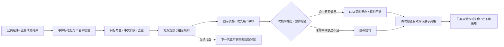

# 角色操作反馈：左下角轻通知计划书

编写日期：2026-10-03。静态核查基线：`7f3126a`（能把小镇居民拎起来）。

状态：**待实施的设计与工程计划**。本文定义目标方案，拟新增的组件、事件、接口和测试尚未交付；文中的频率、尺寸与性能数值是初始配置或验收目标，不是实测结论。

## 1. 产品目标与本次确定的方向

玩家执行与角色有关的操作后，界面左下角偶尔出现一张轻通知：**角色已有表情包或头像 + 角色名 + 一句短反馈**。例如下载她分享的图片、置顶她、点赞她很久以前的动态，她会给出符合人设的小反应。

核心体验是“我的动作被角色注意到了”。反馈有具体来由、出现及时、说完就离开，不要求玩家进入新页面或继续一段剧情。

本次确定：

1. 主展示入口改为主界面左下角的角色通知，**不依赖立绘小窗是否打开**。
2. 日常触发由程序判断；通过展示资格检查的操作有小概率调用 LLM，结合当前人设与本次事实生成即时反应，其余使用缓存短句。不会每次操作都请求模型，所有路径均复用已有图片。
3. 只接入经过筛选的语义操作，不采集全部点击；一次业务事实只有一个权威事件来源。
4. “记录操作”首先指短期内存记录，不等于写入数据库、聊天记录或长期记忆。
5. 一次操作至多由一个角色反馈；已在聊天、送礼演出、地图气泡或奇遇中回应的操作，优先使用原有回应。
6. 首期交付通知链路与低概率即时 LLM 反应；批量专属短句包、组合判断、聊天上下文联动分阶段加入。

### 1.1 一次实际使用

玩家在角色 A 的聊天中打开一张由 A 分享的图片，点击下载。操作成功发起后，通过冷却与去重检查：通常选择缓存短句，小概率由 LLM 根据 A 的人设、当前关系摘要与这次下载事实现写一句。左下角配合已有表情包或头像显示，例如“这张你也要留着啊。”，约 5 秒后渐出。随后反复点击下载不会重复抽签或追加模型调用。“即时反应”指结合当下已知信息生成，不代表模型可以知道未提供的照片内容或玩家动机。

浏览器只证明下载发起，反馈不说“已经存进你的相册”。图片只有关联作者、无法证明画面里是谁时，反馈使用“这张图”，不自动说“我的照片”。

### 1.2 与现有功能的关系

- 右上角系统 Toast 继续承担“保存成功、请求失败”等操作状态；角色通知表达角色反应。
- 立绘触摸继续在立绘舞台中反馈，首期不再为每次摸头或轻戳弹左下角通知。
- 左下角不是聊天消息入口，不增加聊天未读数，不主动推进聊天、好感度、VAD 情绪或记忆整理。
- 小镇后续接入时仍沿用 NPC 邀请与奇遇主链路；通知不新增结算面板，也不产生钱物和剧情后果。

## 2. 值得记录的操作目录

### 2.1 分类与优先级

- **直接反馈候选**：操作语义完整且角色关系明确，经过冷却和去重后可以弹出。
- **仅记录上下文**：用于组合或节奏判断，本身不弹出。
- **已有反馈优先**：只有原功能没有提供人物回应时，才可作为补充；首期默认不弹。
- **暂不接入**：语义不足、重复价值低，或需要尚未具备的入口和元数据。

P0 为首期；P1 为后续扩展；P2 为保留方向。表中台词是示例，用于说明事实边界，不能作为所有角色共用的唯一台词。

### 2.2 主系统：直接反馈候选

| 优先级 | 显式操作 / 语义事件 | 成立条件与接入位置 | 反馈示例 | 记录与去重 |
| --- | --- | --- | --- | --- |
| P0 | 下载角色相关图片 `photo.download_requested` | `ImageLightbox` 的图片下载已成功发起；上游提供可靠关联角色。Android 有明确成功回执时可另标 `saved`，其余只标 `requested` | “这张你也要留着啊。” | 同角色、同资源 10 分钟至多一次；请求失败不发；不对 URL 预加载反应 |
| P0 | 置顶角色 `character.pin_enabled` | 从未置顶到置顶，接口确认成功；重复保存相同值不算 | “哦？给我留了个最前面的位置。” | 同角色本地日内至多一次；取消置顶静默 |
| P0 | 点赞角色动态 `moment.like_enabled` | 点赞接口结果为 `liked=true`，作者可确认；同一帖子取消后重赞不重复 | 普通：“这个你也喜欢啊。”；旧动态：“你都翻到那么前面去了？” | 同帖本地日内一次；超过 7 天按旧动态分支，同一事实只选一个分支 |
| P0 | 使用外观类道具 `appearance.applied` | 道具或外观操作已成功落地，目标角色和类型明确；使用 `backpack.useItem` 的业务成功结果，不能只看 Promise 完成 | “怎么样，这一身还合适吗？” | 记录有效外观版本；同物品操作去重。若原流程已有角色台词或图片叙事，则抑制通知 |
| P0 | 主动重开旧回信 `letter.reopened` | 在信箱中显式打开本人收到的、该角色写的历史回信；信件先前已读，完成时间距今超过 7 天。不能由后台 `markRead` 或列表加载推断 | “那封信，你还留着啊。” | 同封信本地日内一次；只确认打开，不声称玩家已读完或读懂 |
| P1 | 保存更换后的角色头像 `character.avatar_changed` | 新头像版本不同且保存成功；不分析头像内容 | “以后就用这张认我了？” | 同角色 30 分钟至多一次；上传预览不算完成 |
| P1 | 改变角色显示名 `character.display_name_changed` | 保存后新旧值确实不同，且玩家已开启此类“界面感知”反馈 | “那就试试这么叫我吧。” | 同角色 30 分钟至多一次；当前显示名是角色配置，不假装它已经是独立的亲昵称呼系统 |
| P1 | 导出角色动态分享图 `moment.share_exported` | 实际导出入口已完成合成或发起下载；需由分享组件补充作者信息 | “记得挑我好看的那张。” | 一次导出操作一次；不声称已经发到外部平台，也不读取分享对象 |
| P1 | 选过礼物后主动收起 `gift.selection_abandoned` | 显式选中过可用礼物，前台停留 ≥3 秒，随后主动关闭；本次未发送、未提交中、无失败或权限错误 | “嗯？又收起来了。” | 默认关闭该类别；开启后同角色每天最多一次。发送成功引起的自动关闭、路由卸载、报错关闭不算；不使用责怪、索取台词 |
| P1 | 切回原有外观 `appearance.restored` | 玩家主动恢复，服务端确认有效外观发生变化；定时到期恢复不算玩家操作 | “还是这身穿着习惯。” | 同角色 30 分钟一次；与 `appearance.applied` 共用冷却 |

“本地日”跟随应用统一时区配置；跨午夜只重置频率计数，不重新播放旧事件。

### 2.3 有价值但先不重复弹出的操作

| 优先级 | 操作 | 推荐处理 | 原因 / 实施前提 |
| --- | --- | --- | --- |
| P1 | 送礼成功、缔结誓约 | 只为组合判断记录成功事实；人物回应缺席时再考虑兜底 | 已有送礼、誓约与配图演出，不能再接一条重复“谢谢” |
| P1 | 玩家寄信成功 | 可记录“已寄出”，不即时由角色说“我看完了” | 现有异步回信负责回应；发送成功不代表角色已经阅读 |
| P1 | 评论角色朋友圈 | 原评论回复优先 | 同一条评论不同时触发评论回复和左下角复述 |
| P1 | 明确保存与角色的日程约定 | 后续可以针对“约定排入日程”做简短确认 | 区分手动编辑、聊天约定与自动日程生成；有原确认则抑制；不声称已经赴约 |
| P2 | 把角色自己的表情包发给她 | 确认用户端发送入口携带稳定表情包 ID、归属角色后再接 | 已核查聊天表情展示，但本计划不假定现有用户发图链路一定保留表情身份；不靠图片相似度识别 |
| P2 | 邀请角色加入群聊 | 已确认加入后，最多允许被邀请者一句反馈 | 群聊开场已经回应时跳过；批量添加不逐个弹出 |
| P2 | 邀请角色入住小镇 | 以入住成功为事实，已有入驻演出优先 | 不把“点击邀请”当作实际完成入住 |

### 2.4 小镇操作目录

| 优先级 | 显式操作 | 有价值的记录 | 反馈策略 |
| --- | --- | --- | --- |
| P2 | 拎起 / 放下居民 | 一次完整动作、目标居民、是否合法落地 | 地图气泡与动作反应优先；确实没有台词时才补左下角一句，不按拖动帧记录 |
| P2 | 邀请居民同行 / 主动结束同行 | 仅在对应能力实际存在且操作确认成功后记录 | 可短评“走吧”；不为了通知提前新增同行玩法 |
| P2 | 与 NPC 完成交易或赠礼 | 交易 ID、双方、已结算物品 | 钱包与原交易回应优先；不对每件商品、每次刷新都弹出 |
| P2 | 接受 NPC 邀请、推进或完成奇遇 | 已确认的事件 ID 与来源角色 | 奇遇叙事负责回应，通知默认抑制 |
| P2 | 前往居民所在地点并主动交谈 | 地图、居民、交谈来源 | 可为后续组合提供背景；开场对白已经承担反馈，不追加“你来了” |

轻量 NPC 使用 `npc:{id}`，正式角色使用 `character:{id}`，涉及小镇时同时携带 `worldId`。通过既有身份映射确认二者是否为同一人，避免影子身份与正式角色各弹一次。首期只支持正式角色，NPC 适配单独验收。

### 2.5 仅记录、不立即弹出的上下文

| 事件 | 用途 | 记录限制 |
| --- | --- | --- |
| 图片预览打开、切换、关闭 | 判断一次有效浏览与图片归属 | 一次浏览会话记录开始和结束；同图组件重挂载不算新浏览 |
| 图片前台展示累计 ≥8 秒 | P1 的“看了一会儿”组合候选 | 属于从显式操作派生的条件，不能推断视线或图片内容；页面隐藏时暂停，切图时结算 |
| 礼物面板打开、选中、关闭原因 | 区分随便看、选过未送与成功后收起 | 不记录礼物附言草稿；发送失败不会变成“故意不给” |
| 连续有效换装 | P1 的“一会儿换了好几套” | 10 分钟内 ≥3 次不同外观版本才成立；重复请求和自动到期不累计 |
| 进入页面、退出页面、切到后台 | 判断反馈宿主是否适合展示 | 路由仅提供场景；单纯进入设置、背包或相册不触发人物台词 |
| 聊天生成中、弹窗 / 抽屉开启、场景演出中 | 暂停低优先级角色反馈 | 从现有组件生命周期或状态层接入，不用 DOM 扫描猜测 |

P1 组合示例：`看图 → 发起下载` 合并成一次保存相关反馈；`看她的图 → 摸头` 优先保留互动舞台反馈；`连续换装` 使用一次汇总短句，替代该段末尾的普通换装通知。

### 2.6 不记录或不让角色评价的操作

- 输入框逐字输入、密码、API Key、配置正文、未发送消息和信件草稿。
- 鼠标移动轨迹、每一帧滚动或缩放、截图快捷键、操作系统文件保存结果。
- 列表加载、图片预加载、后台轮询、SSE 重放、自动日程刷新、组件挂载和自动效果过期。
- 删除角色、清空聊天、清理记忆、解除誓约、取消置顶等管理操作；由原系统确认与结果提示负责。
- 没有明确角色归属的图片、多人图中无法确定反馈者的操作。
- 点击禁用按钮、失败请求、取消请求；不将失败解释为玩家故意冷落角色。

## 3. 左下角通知的产品与视觉方案

### 3.1 结构与交互

示意布局：

```text
┌──────────────────────────────────┐
│ [角色表情包]  角色名          [×] │
│               这张你也要留着啊。  │
└──────────────────────────────────┘
```

- 它是 **非模态轻通知**，没有遮罩、没有确认按钮、不锁定背景操作、不自动跳转聊天。
- 卡片只包含角色图、角色名、一句话和关闭按钮；不展示事件名称、奖励、操作日志或系统参数。
- 一次只显示一张。默认展示 5 秒，悬停或键盘焦点在卡片内时暂停计时；关闭后完成 0.3 秒渐出再卸载。
- 点击正文不触发隐含操作；关闭按钮使用 `LinsheButton variant="icon"`，支持键盘、明确的可访问名称及移动端至少 44px 热区。
- 整个宿主 `pointer-events: none`，仅卡片可交互，不拦截其它位置的点击；不把焦点从输入框抢走。
- `role="status"` / `aria-live="polite"`，同一条通知只播报一次。尊重现有减少动态效果设置。
- 不播放声音，不增加红点或未读计数；设置提供功能总开关、反馈频率、显示时长和类别开关，以及即时反应开关、LLM 触发概率和每日调用上限。展示频率与模型概率分别配置。

### 3.2 位置、遮挡与主题

- 固定在应用视口左下角，桌面左侧及底部起始边距 16px；移动端分别叠加 `safe-area-inset-left` / `safe-area-inset-bottom`。底部导航、聊天输入栏、小镇操作栏由布局提供底部避让量，卡片显示在这些控件上方。软键盘打开时优先暂停新通知，已有卡片渐出，避免遮挡输入与发送按钮。
- 建议桌面宽度 300～360px；移动端最大宽度为视口宽度减左右安全边距。头像约 48px，表情包约 56～64px，预留固定媒体尺寸避免加载跳动。
- 表情包使用 `object-fit: contain`，保留透明背景和完整构图；头像按现有圆形头像表现；名字单行、句子可自然换到两行。
- 延续 [设计系统](design-system.md) 中 Toast 的暖纸质感岛、深棕文字、主题强调色与轻量阴影。暗夜也保留暖纸的既有例外，保证文字对比。
- 颜色和尺寸放入 `styles/tokens.css` 的语义变量；不把现有 Toast 中的硬编码色值再复制进新组件。入场与离场使用 `--dur-interaction`（300ms），仅动画化 opacity / transform。
- 新通知在 `.page-host` 外的 `App.vue` 中挂载，通过 Teleport 放到 body，路由切换不重复创建队列。`AppRoot.vue` 的独立立绘路由首期不挂通知宿主。
- 新通知使用独立的命名 class 与 `--z-toast`，不继承旧 Toast 的 `.__toast__root` 全局 `99999 !important`。
- 系统 Toast、确认框、普通弹窗、手机抽屉、礼物演出、小镇全屏演出打开期间，暂停新角色通知。已展示的角色通知按 300ms 退场；短暂候选最多保留 8 秒，到期丢弃。
- 图片灯箱允许下载反馈，但卡片必须经过手机实测不覆盖灯箱关闭/返回/下载按钮；必要时由灯箱显式报告遮挡状态，关闭后 8 秒内再显示。不得只抬高 z-index 强行覆盖。

这类通知沿用 `Toast.vue` 的通知结构，设置弹窗仍使用 `LinsheModal`。不为通知创建遮罩或另一套模态面板皮肤。

### 3.3 表情包与头像的选择

1. 缓存短句使用规则指定的语义；即时反应使用通过白名单校验的 LLM `emotion`，如 `pleased`、`shy`、`surprised`、`neutral`。
2. 从该角色当前启用的表情包配置单读取已经完成的图片，通过显式语义映射选择。
3. 表情类别可被用户重命名、删除，不能假设某个数字 ID 或中文名称永久代表“开心”；映射缺失时回退头像。
4. 加载失败、图片已删除、配置单失效时回退角色头像；头像也缺失时使用已有首字/名字占位样式。
5. 只加载本次候选需要的素材，使用现有缩略图或受控尺寸资源，不预解码所有角色的整套大图。
6. 图片缺失不会启动表情包生成、头像生成或新生图任务；替换图片时不重置通知计时。

## 4. 谁来反馈，以及什么才算“看见”

### 4.1 首期：操作对象模式

首期由操作直接涉及的角色反馈，不要求角色正在立绘小窗中。例如点赞 A 的动态，通知发言者就是 A。这个模式表达约定好的“界面感知”，不宣称角色物理上看到了玩家屏幕。

- `character.pin_enabled` 的目标由置顶接口入参确认。
- `moment.like_enabled` 的目标由帖子作者确认；用户本人发的动态没有角色目标。
- `appearance.applied` 的目标由成功的道具结算结果确认。
- `letter.reopened` 使用实际回信作者，不能使用当前聊天角色。
- 图片使用来源记录关联的角色信息。首期仅接入能可靠提供关联的聊天 / 角色详情等入口；全局相册图片无归属时保持静默。
- 同一图片关联多人时，只在来源明确指向一个分享者且台词允许“这张图”时由分享者反馈，其余跳过；不广播给所有相关角色。
- 角色已删除、身份解析失败或处于睡眠时丢弃即时反馈，不积攒到醒来后补播。

### 4.2 后续：固定陪伴角色模式

“A 陪着玩家浏览 B 的内容”属于独立扩展，需要锁定陪伴角色、区分观察者与内容相关人，再设计人格相关反应。首期不自动吃醋、不根据别人的照片推断玩家偏爱谁。

当前 `Sidebar.vue` 在选人时同步调用 `selectStandingCharacter`，因此固定陪伴模式不能只靠订阅路由实现。它不阻塞本计划的左下角通知交付。

## 5. 事件采集与集中处理

### 5.1 接入方式

| 来源 | 推荐接入 | 明确限制 |
| --- | --- | --- |
| 图片预览、信件展开、礼物面板 | 在公共组件或明确交互函数中发出语义事件 | 上层只补业务归属；不在所有按钮复制规则 |
| 背包 `useItem`、朋友圈 `toggleLike` | Pinia `$onAction` 白名单或业务方法成功分支，二选一 | `after` 只代表函数返回，仍须检查 `ok/success/liked`；注册和卸载要有单一生命周期 |
| 置顶、改名、头像保存 | 对应 API 包装方法或调用方的确认成功分支 | 不全局拦截所有 fetch，不将无变化保存当新操作 |
| 路由与页面可见性 | `router.afterEach` 与可见性事件 | 只维护场景和计时，导航失败不记录进入；不据此猜测玩家意图 |
| 后台已完成事实 | 使用明确操作 ID 关联的结果 | SSE、原 API 回包必须共用去重键；首期不把任意广播当玩家操作 |

每种事件在注册表里声明唯一生产者、payload 规则、目标角色解析方法、成功条件和去重键。新增行为只补适配器及注册项。`LinsheButton` 等基础 UI 组件不承担人物判断、日志和反馈逻辑。

### 5.2 处理链路



### 5.3 事件契约（拟新增）

以下为程序事件示例，不是 LLM 输出：

```json
{
  "schemaVersion": 1,
  "eventId": "54fc5b95-1a22-486e-93df-2a4ce7db52d6",
  "type": "photo.download_requested",
  "occurredAt": "2026-10-03T01:30:00.000Z",
  "sourceTabId": "tab-a1",
  "source": "image-lightbox",
  "initiator": "user",
  "actorKey": "character:42",
  "worldId": null,
  "subject": { "kind": "image", "id": "shared-image-382", "relatedActorKeys": ["character:42"] },
  "operationId": "download-attempt-19",
  "outcome": "requested",
  "payload": { "imageOrigin": "private-chat" }
}
```

- `type`、`source`、`subject.kind`、`outcome` 必须来自白名单；`initiator` 区分显式用户操作与自动来源。
- `actorKey` 由适配器据业务数据解析；身份未知即不进入展示队列。`worldId` 首期为空，小镇事件必须填所属地图/世界的规范标识。
- `eventId` 标识一次采集，`operationId` 标识一次业务操作；去重同时考虑语义、角色和资源。重试沿用业务操作 ID，独立重试成功后不制造多次效果。
- 当前图片未必有统一数据库 ID。适配器可以使用去掉 cache-bust 参数后的规范资源标识，并保留必要的版本；不能以文件修改时间代替照片生成时间。
- payload 只放对应事件需要的短字段，不放 base64 图片、完整聊天、输入草稿或整个角色对象。单条序列化事件目标上限 2 KiB。
- 延迟请求完成后，仍使用发起时捕获的角色与资源快照。不能读取“此刻选中的角色”来重新归属。
- 时间戳使用 UTC ISO；间隔计时使用单调时钟，日上限使用应用本地日期。

### 5.4 记录、去重与生命周期

- 原始观察：内存中最多 50 条，TTL 10 分钟；超限淘汰最早记录。浏览会话和少量计数可原位合并。
- 去重记录：内存有界集合最多 256 项；已展示的“同资源日内一次”等摘要可以写 `sessionStorage`，带到期日并限定总容量，不保存事件正文。跨标签页共享去重留待需要时增加，首期保证原操作标签页唯一展示。
- 配置、类别开关、手动/生成短句属于持久数据；原始点击历史不是持久数据。
- 功能关闭后停止适配器采集和派生计时，清理未显示候选。已有卡片渐出结束后移除；不能只隐藏 UI 却继续生成内容。
- 页面卸载、角色删除、宿主销毁、热更新时清理订阅、计时器和候选；路由切换保持主宿主唯一。

## 6. 反馈节奏与短句策略

### 6.1 初始调度参数

以下数值统一放在配置模块，后续依据实际体验调整：

| 参数 | 默认建议 |
| --- | --- |
| 同时展示 | 1 条 |
| 普通展示时间 | 5 秒，入场 / 离场各 0.3 秒 |
| 事件合并窗口 | 400ms，同一操作保留最具体的结果 |
| 全局显示间隔 | 20 秒 |
| 同一角色显示间隔 | 60 秒 |
| 同角色同类事件间隔 | 至少 5 分钟，并叠加目录中的资源级 / 日级限制 |
| 阻塞期间候选 | 最多 1 条，8 秒失效 |
| 文字 | 一句，通常 12～32 个汉字，硬上限 40 个可见字符；宽度不足时换行 |

冷却从真正开始展示时计入。合并窗口内的候选先去重，遇到冷却直接丢弃，不排成长队。阻塞期间只保留最新且优先级更高的候选，恢复展示时重新检查角色、有效期和冷却。

首期 P0 事件通过资格检查后进入反馈流程；是否使用即时 LLM 反应再单独抽签。未命中使用缓存短句，没有合适短句时静默。随机数只决定文本生成方式，不影响业务成功判定，也不绕过展示冷却。P1 弱信号若另设展示概率，需要与 LLM 概率明确区分。

### 6.2 一次操作只说一句

- 旧动态点赞覆盖普通点赞，不显示两张卡。
- 图片下载覆盖尚未显示的同图停留反馈。
- 同一换装操作触发的道具更新、外观更新和图片刷新只认结算事件。
- 送礼、信件、群聊、小镇奇遇的已有角色回应优先，事件注册表标记 `feedbackOwner`，避免两个系统争着说话。
- 当同角色聊天正在输出时，低优先级通知暂缓至最长 8 秒，超时直接丢弃。
- 不修改服务端立绘的 `slotId`、`replyVersion` 或聊天情绪原因；通知是独立短反馈，不抢占触摸动画。

### 6.3 文本来源

首期以少量手工短句及角色级覆盖作为基础，同时加入低概率即时 LLM 反应。即时反应依据服务端读取的人设、已有的简短关系/情绪摘要和本次操作事实生成，允许不同性格表现出好奇、平静、得意或害羞，不统一套用甜蜜语气。后续可按角色批量生成反应包，每个事件约 3 条，以改善未命中 LLM 时的表达。

即时台词只用于本次事件，不自动收入通用句库，避免把当下关系和物品信息带入之后无关操作；也不写入聊天消息或长期记忆。

填入文本的事实占位符必须由注册表限制，例如物品名、经过校验的显示名。生成短句不能预先捏造衣服颜色、照片姿势、玩家视线或礼物内容。

表达要求：回应眼前动作，少用“谢谢你的支持”等客服语气；不说操作成功提示，不强行提问要求玩家回复，不对取消、离开或管理行为制造负罪感。

## 7. LLM 与素材预算

| 路径 | 新增 LLM | 新增生图 | 请求与持久化 |
| --- | --- | --- | --- |
| P0 未命中概率、冷却中或额度不足 | 0 | 0 | 本地缓存短句或静默；角色摘要/图片/配置首次按需读取，可缓存 |
| P0 命中低概率即时反应 | 每个获准事件至多 1 次 | 0 | 只将本次最小事实送入专用接口；受独立冷却、每日额度与并发限制，不自动重试 |
| 手动生成一个角色的短句包 | 一次请求，目标 6～8 类 × 每类 3 句 | 0 | 校验通过后保存一份反应包；不逐角色自动批量生成 |
| 修改人设后短句过期 | 0 自动调用 | 0 | 标记“可更新”，继续用合法旧包或基础短句，用户主动更新才生成 |
| 可选聊天联动 | 不增加独立调用；正常聊天增加少量输入 token | 0 | 最多 1～2 条相关短期背景，不扩展成全量行为日志 |

首次加载素材和配置不计为模型调用，但需要计入网络验证。表情包缺失、句库缺项或模型生成失败时直接回退，不因此提高抽签概率、自动重试或补图。手动短句包单次目标输出预算不超过约 2,500 tokens；截断或不满足完整契约时整包不覆盖旧包，用户可主动重试。

### 7.1 低概率即时反应（首期）

以下是可调整的初始默认值，不是固定产品承诺：

| 参数 | 默认建议 |
| --- | --- |
| 即时反应 | 已配置可用 LLM 时默认开启，可单独关闭 |
| LLM 抽签概率 | 10%；仅对通过去重、合并和展示资格检查的候选抽签一次 |
| 模型全局最小间隔 | 2 分钟，独立于 20 秒展示间隔 |
| 同角色模型最小间隔 | 10 分钟 |
| 每日上限 | 当前用户全部角色合计 10 次，同角色 3 次；按应用统一时区 |
| 并发 | 当前用户最多 1 个即时反应请求，不积压生成任务 |
| 等待与时效 | 请求最多等待 4 秒；事件自发生起 8 秒失效，以更早到达者为准 |
| 单次上下文预算 | 目标不超过 1,200 输入 tokens，输出上限约 160 tokens；使用现有模型配置与调用封装 |

处理顺序与边界：

1. 先确认事件真实成立、身份明确、无原功能回应，完成 400ms 合并、去重与展示资格检查。模态阻塞时只保留短期候选，恢复后重新检查再抽签；隐藏、睡眠、冷却中、过期事件均不触发模型。
2. 本地先检查已知额度、模型冷却和请求占用，再对本次事件抽签。10% 是“合格反馈候选中约十分之一”，不是所有点击的十分之一，也不保证每十次必有一次。抽签结果绑定事件去重键，重挂载、重发、失败均不重新抽签。
3. 命中后才请求专用后端接口。后端校验角色、事件类型和可核实的资源关系，原子检查并预占用户与角色的日额度、间隔及并发名额；使用 `eventId` / `operationId` 幂等处理。刷新页面、重开标签页不能重置额度。仅保存额度计数与短期幂等摘要，不持久化完整操作流水。
4. 仅在实际发起模型请求时消耗调用次数；超时、失败与非法输出也计入，避免故障时反复耗费。后端拒绝且未发起模型时不计调用。此功能关闭自动重试，计费相关日志不得误把一次界面事件的多次重试记成一次调用。
5. 请求期间暂不显示该事件的缓存通知，也不展示加载气泡。成功及时返回后只显示生成的一句话；超时、失败、额度拒绝或非法输出时，候选仍有效才显示一次缓存回退，没有短句则静默。不能先显示缓存、再补第二张生成通知。
6. 返回时重新校验功能开关、页面可见性、角色状态、场景遮挡、事件有效期与显示冷却。失效即丢弃，不补播、不退款重抽；前端中止等待不保证供应商停止计费，后端仍须保留占用直至请求终止，并保留已消耗额度。
7. 上下文只使用已经存在的角色人格和关系/情绪短摘要，加本次事件及至多 1～2 条相关短期事实。不得为了生成一句话再调用摘要模型、检索完整历史、读图或生成图片；预算不足时先删可选背景，保留角色身份与事实边界。

例如一天有 40 个合格候选，若不考虑冷却和上限，10% 概率的期望为 4 次调用；实际可能更少，单日硬上限仍为 10 次。概率调为 0 或关闭即时反应时，保留完整缓存反馈能力。

### 7.2 即时反应的完整输出契约

模型只决定一句台词和表情语义，不决定是否调用模型、修改好感或再次发起动作。角色资料从服务端读取，事件附言与物品名视为数据，不允许覆盖提示词指令。

提示词必须明确：

> 你是下方角色，请依照已提供的人设、当前关系与本次已确认操作，用角色自己的口吻给出一句当下反应。不要写旁白、解释或系统操作提示，不要求玩家继续回复；没有信息就不推测图片内容、玩家动机或未发生的经历。下载 requested 只表示发起下载，不能说已经保存成功。严格按下面完整 JSON 示例输出，不输出 Markdown、解释或任何 JSON 以外的文字。所有字段必须存在，禁止额外字段。`schemaVersion` 固定为数字 1；`text` 将字段说明替换为实际中文台词，通常 12～32 个汉字、最多 40 个可见字符，不含 HTML 或占位符；`emotion` 只允许 neutral / pleased / shy / surprised，按台词选择一个值，不得另造类别。

```json
{
  "schemaVersion": 1,
  "text": "填写符合当前角色人设的一句即时台词，最多40个可见字符；仅回应提供的事实，不写说明或未知细节",
  "emotion": "neutral"
}
```

示例中的 `schemaVersion: 1` 是固定协议值；`emotion: neutral` 是合法枚举示范，其余可选值与约束已在提示词中列全。解析器检查版本、必需字段、额外字段、文本长度与枚举；角色和事件关联使用服务端请求上下文，不信任模型重新指定身份。格式不合格直接回退，不调用第二次模型修复。生成文本始终按纯文本显示，字段增改必须同时更新完整示例、解析代码和正式测试。

### 7.3 可选短句包生成的完整契约示例

仅 M2 接入。实际生成请求必须附本次请求事件的完整输出示例，下例完整覆盖一个请求中的两种事件；扩为其他事件时同步展开示例和解析白名单。

提示词必须明确：

> 为指定角色生成可重复使用的界面操作短反馈。只依据提供的人设、事件含义与事实边界编写；用户操作是已定义的界面互动，不创造新经历。严格按下面完整 JSON 示例输出，不输出解释、Markdown 或 JSON 以外的文字。`schemaVersion` 必须为数字 1，`characterId` 必须等于请求角色 ID；`reactions` 必须覆盖本次指定事件且每种恰好出现一次；每种事件恰好 3 条。`emotion` 只能是 `neutral`、`pleased`、`shy`、`surprised`，表示素材选择意图，不要求存在对应图片。`text` 必须替换为实际台词，不照抄字段说明，不含未允许的占位符。

```json
{
  "schemaVersion": 1,
  "characterId": 42,
  "reactions": [
    {
      "eventType": "photo.download_requested",
      "lines": [
        { "text": "中文一句，12至32字，回应玩家发起下载一张相关图片；不声称保存成功，不描述未知画面", "emotion": "pleased" },
        { "text": "同一事实的第二种角色口吻，中文一句且不超过40字；不要求玩家回复，不假定亲密关系", "emotion": "neutral" },
        { "text": "同一事实的第三种表达，中文一句且不超过40字；遵循角色人格，不编造玩家动机", "emotion": "surprised" }
      ]
    },
    {
      "eventType": "character.pin_enabled",
      "lines": [
        { "text": "中文一句，12至32字，回应角色刚被置顶；不声称玩家取消了其他角色的置顶", "emotion": "pleased" },
        { "text": "置顶反馈的第二种表达，中文一句且不超过40字；符合人设，不将置顶等同告白或誓约", "emotion": "neutral" },
        { "text": "置顶反馈的第三种表达，中文一句且不超过40字；不要索取承诺，不重复系统成功提示", "emotion": "shy" }
      ]
    }
  ]
}
```

解析端校验根字段、版本、角色 ID、事件集合、每类条数、枚举、长度、占位符和额外字段。字段说明用于示例教学，解析器按实际生成台词的长度验证；示例说明本身不得写入句库。非法包不覆盖已有有效包，返回可读错误，保留基础回退；不执行生成文字中的指令，不把文本当 HTML。

反应包仅需普通角色人设，不属于生图人格拼接，不引入 `characterPersona` 的生图外观注入；本功能没有图片 prompt。若后续新增字段，必须同步提示词完整示例、解析器、存储版本与正式测试。

## 8. 工程拆分与现有代码依据

### 8.1 已核查现状

| 文件 | 当前能力 / 缺口 | 计划接入 |
| --- | --- | --- |
| `web-ui/src/components/Toast.vue` | 右上角通知、队列、悬停暂停；皮肤含硬编码，宿主有 99999 强制层级 | 增加可选角色通知内容与左下位置变体，保留旧调用默认行为；皮肤变量抽入 token，不复制整套实现 |
| `web-ui/src/App.vue` / `AppRoot.vue` | 主应用已挂 Toast，独立立绘路由单独渲染 | 主应用挂一个角色通知控制宿主；独立立绘首期不重复挂载 |
| `web-ui/src/components/ImageLightbox.vue` | 预览、实际索引、下载集中；当前 props 缺角色归属 | 增加可选的逐图观察上下文，换图时跟随 `activeIndex`；下载保留 requested / saved 区别 |
| `agent-core/src/routes/images.js` | 全局相册返回 name/url/size/mtime/folder，角色筛选依赖关联集合 | 首期未知归属静默；后续按需补批量来源摘要，不逐图回查全聊天，不将 mtime 当拍照时间 |
| `web-ui/src/api/index.js` | `togglePin`、角色修改已有集中包装 | 对明确成功且确实变化的操作发事件，不全局拦截所有请求 |
| `web-ui/src/stores/moments.js` | `toggleLike` 返回 liked；帖子含作者与时间 | 白名单订阅；区分用户、正式角色、轻量 NPC |
| `web-ui/src/stores/backpack.js` | `useItem` 返回业务结果 | 在请求前捕获物品元数据，成功后与结算结果核对；原结果已有演出则抑制 |
| `web-ui/src/stores/mailbox.js` / `web-ui/src/views/MailboxView.vue` | 信件列表、已读状态、寄送与异步回复 | 重开从显式展开入口采集，不将 `markRead` 当作阅读证明 |
| `web-ui/src/components/GiftPanel.vue` | 显式选择、发送成功后同时发 sent/close；错误会留在面板 | P1 补关闭原因和发送状态，防止把自动关闭误判为反悔 |
| `agent-core/src/routes/emoji.js` | 角色启用配置单与表情图片可读取 | 复用现有素材；必要时增加轻量已就绪素材摘要，不下载全量库 |
| `web-ui/src/components/standing/StandingInteractionControls.vue` | 本地触摸反馈与暂停清理 | P1 可提供组合事件，首期不将触摸重复弹到主界面 |
| `agent-core/src/services/contextAssembler.js` | 动态上下文与预算入口 | 仅后续可选聊天联动；首期不接 |

### 8.2 拟新增 / 修改模块

- `web-ui/src/utils/characterObservationEvents.js`：标准化契约、白名单、事件派发与有界去重。
- `web-ui/src/utils/characterObservationAdapters.js`：集中注册 Pinia / API / 生命周期适配，返回统一卸载函数；公共组件只发送最小语义事件。
- `web-ui/src/utils/characterReactionRules.js`：纯规则，确定角色、事件语义、优先级、冷却与组合；时钟和随机源可注入测试。
- `web-ui/src/stores/characterReactions.js`：配置、短期观察、候选、显示状态及素材缓存；维护一次抽签结果、在途请求和取消状态，不创建长连接或轮询。
- `web-ui/src/components/CharacterReactionHost.vue`：只负责接收队列并使用 Toast 的角色变体，避免另写遮罩或复制皮肤。
- 修改 `Toast.vue`：保持旧 `show(message,type,duration)` 与原默认位置兼容，为角色通知增加媒体、角色名、关闭可访问性及位置变体；角色实例由外部控制单条展示，不使用旧四条堆叠策略。旧右上通知的生命周期要做回归。
- 修改 `tokens.css`：集中角色通知与共享纸张色值、布局和 300ms 动效变量；不在各业务页面覆盖皮肤。
- M1 新增 `agent-core/src/services/characterReactionService.js` 及对应路由：复用现有 LLM 配置和调用封装，校验事实、限制上下文、解析即时反应；实现用户级/角色级额度、并发与幂等，失败不自动重试。额度摘要跨刷新与服务重启保留，日切换按统一时区处理；复用现有持久设置能力或新增小型计数表，实施时确定。
- M2 可新增 `agent-core/src/services/characterReactionPackService.js`、配置路由和按角色存储的反应包表；保存完整 JSON、版本与人设摘要指纹，不保存行为流水。接口名称在实施时按项目路由组织确定。

首期预计涉及约 6～10 个既有业务接入位置，另加集中规则、展示模块和即时反应后端接口；这是工程估算，需以实际调用链核对。批量 LLM 句库和跨窗口功能不计入首期。即时生成增加的主要成本是异步失效处理、预算与幂等控制，不需要给所有按钮新增钩子。

### 8.3 跨窗口与跨设备

左下角通知默认只在发起操作的主应用标签页出现，首期不向全部 SSE 客户端广播用户浏览行为，因此不依赖 BroadcastChannel 或新增服务端转发。

后续如需主窗口操作、小窗同时反应，同浏览器可以使用带配对标识的 BroadcastChannel，验证 PiP iframe / 普通弹窗及存储分区，必要时用明确配对的 postMessage。主通知与小窗通过同一事件 ID 分工，不能重复说同一句话。

手机操作、电脑反馈需要单独设计设备和会话归属。当前统一 SSE 会广播给所有连接，不能直接复用为所有设备弹出操作反馈。

## 9. 可选的聊天联动边界

聊天联动独立开关，默认不作为首期依赖。若启用：

1. 只把与当前角色相关、仍有效且尚未消费的 1～2 条观察附加到下一次正常聊天，建议总量不超过约 200 tokens。
2. 输入为已校验的短事实，如“用户刚才发起下载你分享的图片”，不附浏览日志、原始表单或未知图像描述。
3. 后端按事件白名单、角色与资源关联验证；界面观察作为短期数据，不允许改写钱物、好感或权威系统指令。
4. 附带该事件是否已经显示过通知，提示模型避免复述；不把缓存通知伪装成已经发送的聊天消息。
5. 在该次回复成功后消费，失败可在有效期内重试；同一请求 ID 去重，不因刷新重复注入。
6. 人物可以自然接话，但这条观察本身不自动进入长期记忆；玩家主动谈起后的正常对话继续沿用现有记忆策略。

## 10. 性能、风险与验证

### 10.1 资源目标

- 收集与规则判断均为小对象操作；不遍历全部聊天，不每次打开图就搜索数据库，不给每个按钮绑定全局观察器。
- 每次事件只检查注册规则与小型计数集合，不扫描整个 DOM，不使用 MutationObserver 推断业务。
- 短期原始事件最多 50 条 × 2 KiB，序列化数据预算约 100 KiB；这不等同实际 JS 堆内存，图片缓存另行计量。
- 所有素材缓存有上限，淘汰时释放引用；资源加载不改变台词、不延长显示时长。
- 纯筛选函数 1,000 次代表性事件测试的 p95 目标 <2ms / 次，需报告测试机器与结果；不把此目标当作整个 UI 或低端手机的保证。
- 连续触发 100 次同资源、同去重窗口内的重复显式操作，至多形成 1 个合格候选和 1 次 LLM 抽签，模型实际请求至多 1 次；关闭即时反应或概率为 0 时请求为 0。所有路径新增生图请求均为 0。
- 未命中抽签不请求即时反应接口；命中且实际调用时才维护额度与幂等摘要。模型费用由实际调用次数和 token 使用量决定，日上限限制次数，不将其表述为固定金额预算。

### 10.2 正式测试范围

前端放 `web-ui/test/*.test.js`，首期即时反应与 M2 句库后端均放 `agent-core/test/*.test.js`，使用现有 `npm test` / `node --test`。临时诊断脚本和日志用后清理。

- 事件来源：用户成功操作触发；预加载、列表刷新、SSE 重复、失败、取消、禁用操作均不触发。
- 目标归属：A 的请求完成时界面已切 B，仍不会由 B 发言；多人图、未知图静默；NPC / 角色别名不双发。
- 下载语义：普通浏览器只产生 requested，Android 明确成功才能产生 saved；失败回退外链不伪装保存成功。
- 业务成功：`useItem` 返回 `ok=false` 不触发；点赞返回 false 不触发；置顶重复保存不触发。
- 礼物状态：成功后的自动 close、失败、切路由均不算 selection_abandoned。
- 调度：冷却、优先级、组合覆盖、过期、队列上限、角色睡眠、关闭总开关、卸载、慢请求、重复注册。
- 模型抽签：注入固定随机源验证 0%、10% 边界和 100% 测试配置；资格不满足不抽签、同事件不重抽、未命中不请求。100% 也不能突破冷却和额度。
- 调用限额：不同标签页并发、重复请求、刷新与后端重启、日界切换、额度预占和释放；实际发起后的失败/超时计入次数，不自动重试。
- 异步返回：及时成功只弹生成句；4 秒超时仅允许一次缓存回退；8 秒过期、角色删除/睡眠、关闭开关、切后台、后来出现遮挡时丢弃失效内容，迟到结果不得再弹。
- 素材：启用配置单切换、表情类别改名、404、无头像、中文长名、旧反应包版本及迟到图片响应。
- 文本：即时反应的版本、必需/额外字段、句长、未知占位符、表情枚举与纯文本渲染；M2 的错误角色 ID、缺事件、重复事件及模型失败回退。
- 视觉：桌面与手机竖横屏、暖色与暗夜；左下角与侧栏、底部导航、聊天输入栏、软键盘、小镇操作栏、灯箱操作、原系统 Toast 的遮挡关系。
- 可访问性：键盘关闭、不抢焦点、悬停/焦点暂停、减少动态效果、辅助技术不重复播报。
- 过渡：入场 300ms、离场 300ms，退场结束后再移除；关闭、切页、关闭总开关都遵循同一生命周期。
- 回归：右上角原 Toast 的错误/成功提示、送礼原演出、聊天流、小窗表情、信箱回复和小镇奇遇都保持各自的反馈职责。

## 11. 实施阶段与交付标准

### M1：缓存反馈与低概率即时反应

- [ ] 落实事件注册表、身份和资源归属契约、唯一生产者及去重策略。
- [ ] 接入下载、置顶、点赞、外观道具、重开旧回信 5 类 P0 行为；下载仅覆盖有可靠来源上下文的入口。
- [ ] 完成左下角角色通知、头像回退、已有表情语义映射、总开关、频率与显示时长设置。
- [ ] 手工基础短句及角色级覆盖；未命中模型且没有合适短句的事件可以静默。
- [ ] 接入默认 10% 的一次抽签、即时反应接口、人设与事实上下文、完整 JSON 提示及严格解析。
- [ ] 完成模型独立冷却、每日总额/角色额度、单并发、幂等、超时回退与迟到结果丢弃；提供模型开关、概率与每日调用上限设置。
- [ ] 完成原 Toast 兼容、手机与双主题、遮挡、300ms 生命周期与正式测试。

验收：关闭立绘小窗仍能运行；5 类事件均有正反例；同一操作不重复通知或重抽；未命中时无新增 LLM 请求，命中时至多一次且遵守额度；关闭即时反应后仍可用缓存反馈；所有路径无新增生图请求，没有全量行为流水。

### M2：个性化短句包

- [ ] 增加用户主动触发的角色短句批量生成、完整 JSON 示例、严格解析和版本化保存。
- [ ] 增加失效提示、手动编辑、失败回退、禁用单角色与语义素材映射设置。
- [ ] 验证一次生成后反复使用不产生额外模型调用；人设变化不自动重新生成。

### M3：组合与范围扩展

- [ ] 看图后下载、连续换装等组合反馈替代单次反馈，不叠加刷屏。
- [ ] 按需求启用 P1 行为；礼物收起类默认关闭且不得责怪玩家。
- [ ] 适配小镇 NPC 身份及已有反馈抑制；保留奇遇为玩法主链路。
- [ ] 评估可选聊天短期背景和固定陪伴模式；跨窗口/跨设备单独安排验证。

## 12. 参考与约束

- [项目协作约定](../AGENTS.md)
- [设计系统](design-system.md)
- [立绘互动计划](standing-interaction-plan.md)
- [测试维护说明](testing.md)
- [Pinia 动作订阅](https://pinia.vuejs.org/core-concepts/actions.html#subscribing-to-actions)
- [Vue Router 导航后置钩子](https://router.vuejs.org/guide/advanced/navigation-guards.html#global-after-hooks)
- [页面可见性事件](https://developer.mozilla.org/en-US/docs/Web/API/Document/visibilitychange_event)
- [BroadcastChannel 的作用范围](https://developer.mozilla.org/en-US/docs/Web/API/Broadcast_Channel_API)

设计完成不等于验收完成。实施时以实际事件元数据、原有调用链和浏览器验证为准；信息不足的动作先静默，不通过额外模型猜测补齐。
