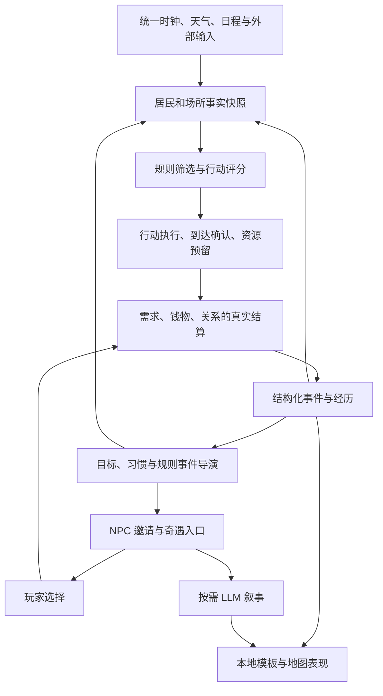

# 小镇生态升级计划

> 状态：设计与工程计划。M0—M7 与任务 T01—T11 已于 2026-09-30 全部实施完成并通过
> 验收清单核对（§13）；本文其余章节描述目标与接入方案，是已实现行为的口径说明。
>
> 编写日期：2026-09-30。现状判断基于编写时的工作区源码；实施前应复核对应模块。
>
> 核心目标：关闭 LLM，小镇仍能自主生活、经营、交往和发生变化；开启 LLM 后，少数重要节点获得更有角色特色的对话与剧情。

## 1. 产品目标与设计取舍

### 1.1 什么算“小镇生态”

生态由一组持续互相影响的系统组成：

**居民需求 → 行动选择 → 资源与环境变化 → 他人反应 → 共同经历与关系变化 → 下一次行动选择。**

居民不只需要在地图上移动，还需要有行动理由、可执行的生活方式和持续的行为后果。例如：

- 饥饿的居民去餐馆吃饭，消费减少自己的金币并增加餐馆收入。
- 餐馆需要原料和工作人员；缺货、缺人会导致服务减少。
- 排队过久的居民改去别处，并对这次经历留下短期情绪影响。
- 经常同一时间来店里的居民逐渐熟悉，之后更愿意一起活动。
- 店员持续疲惫时会休息、调整班次或寻求帮助，而不是无限工作。
- 玩家可以参与解决问题；玩家不参与时，居民仍有自己的应对方式。

小镇的故事首先来自这些真实变化，然后才被文字、对话和画面呈现出来。

### 1.2 借鉴方向

| 参考方向 | 借鉴内容 | 在邻舍中的落地方式 |
| --- | --- | --- |
| 《模拟人生》式生活模拟 | 需求、性格、场景共同影响行动吸引力 | 扩展现有效用评分与行动系统，形成可解释的自主生活 |
| 《环世界》式系统叙事 | 资源、人员状态、关系与外部事件相互影响 | 小规模供需循环、社会关系、规则事件导演 |
| 邻舍现有角色体验 | 人格、陪伴、日程、记忆、奇遇和配图 | 重要经历通过现有角色与奇遇体系呈现 |

本计划是结合项目现状提出的实现方案，不是对上述游戏内部架构的逐项复刻。

### 1.3 第一版边界

第一版聚焦“一条会自己运转的街”，不追求完整社会模拟。

- 8 名预置居民，包含不同性格、职业和生活偏好。
- 餐馆、补给站、书斋三类营业场所，以及住宅、广场、长椅等公共设施。
- 六类需求、十余种动作、简单的双向关系和一条基础供应链。
- 模拟七天能稳定生活，模拟十四天能看见关系、技能或习惯变化。
- 日常运行不调用 LLM；所有初始角色、规则、物品与场所可由本地配置提供。
- 零模型验收也不能依赖外部生图、在线天气或在线日程生成；使用已有资源或本地预置输入。

暂不纳入第一版：死亡与繁衍、完整医疗、复杂税收与贷款、房地产市场、跨镇物流、派系战争、无限开放式任务规划。后续是否扩展，应由实际玩法需求决定。

### 1.4 产品原则

1. **世界事实由规则维护。** LLM 不直接决定价格、库存、关系增减、奖励或交易结果。
2. **玩家不在线，小镇也有生活。** 后台推进与离线补算分别定义，不以页面是否打开决定居民有没有社会生活。
3. **行为必须能解释。** 能回答“为什么去这里”“为什么拒绝”“为什么关系变差”。
4. **失败也有后续。** 客满、缺货、缺钱、找不到人时，居民能等待、替代、求助或放弃。
5. **小镇默认温和。** 采用有恢复路径的生活压力；不让玩家因几天未登录就面对不可逆崩溃。
6. **玩家参与保留奇遇链路。** NPC 邀请 → 奇遇页选择 → 服务端结算 → 世界反馈。
7. **复用现有底座。** 不另建身份、钱包、库存、事件总线或平行的玩法 UI。
8. **先形成闭环，再增加内容。** 新需求必须有满足手段，新资源必须有用途，新事件必须有后果。

## 2. 当前基础与明确缺口

### 2.1 可复用模块

下表中的路径相对仓库根目录。

| 模块 | 已有基础 | 升级方向 |
| --- | --- | --- |
| `agent-core/src/services/town/townActorRegistry.js` | 玩家、轻量 NPC、正式角色的统一身份及合并关系 | 所有新模拟状态使用规范 `actorId`，避免一个人物被模拟两次 |
| `townClock.js`、`routineSchedule.js` | 时区、时间窗口、补算窗口规划、作息匹配 | 接入统一模拟时间与持久化游标；补算规划不等于已实现经济补算 |
| `townFacts.js`、`townRuleEngine.js` | 类型化事实、条件表达式、效用评分、优先级、冷却、稳定选择和切换约束 | 增加需求、关系、供给、目标等事实与规则 |
| `townSimulation.js` | 将作息意图接入行动执行，管理恢复、移动和重试 | 从主要执行工作、休息、等待扩展到自主行动选择 |
| `townActionRunner.js`、`townActionSchema.js` | 行动生命周期、占用资源、幂等请求和活动记录 | 扩展动作处理器、多人行动与可审计的效果结算 |
| `townService.js` | 多地图运行、移动、作息投影、相遇、模板问候、模型演出 | 分离世界社交事实与页面演出；逐步减少单个服务的职责 |
| `economyService.js`、`townEconomySchema.js` | 账户、库存、预留、转移、发行、回收与不可重复结算 | 在原账本上建立居民消费、经营收入、生产和发薪 |
| `townResponsibilityRuntime.js`、`townResponsibilityDefinitions.js` | 地点用途、居民职能和工作地点绑定 | 核实岗位运行与实际生产、营业、收入的连接 |
| `townEventService.js` | 领域事件、持久化投递、消费事务、重试与因果约束 | 复用为生态事件出口；保持副作用可恢复 |
| `townExperienceService.js` | 从有效来源沉淀赠礼和相遇经历，并衔接正式角色记忆 | 普通生活经历由结构化事实生成，不依赖模型摘要 |
| `townInteractionRuntime.js`、`townNpcEventGenerator.js` | 邀请、剧情来源、NPC 奇遇与现有事件系统接入 | 承接从生态中识别出的玩家参与机会 |
| `townNpcStockService.js`、`townNpcStockScheduler.js` | 特色货架、购买、换货和物品图像 | 基础生活供应与生成式特色货架明确分工 |

除首行注明完整目录的文件和数据库文件外，本表服务文件均位于 `agent-core/src/services/town/`。

### 2.2 实施时不能误判的现状

1. 当前模拟桥的主要动作是 `move_to`、`wait`、`rest`、`work_shift`。规则评分框架已存在，但并不代表居民已经具有完整需求决策。
2. `work_shift` 当前表达定时在岗记录，执行器明确不负责发工资或产物。后续必须增加经营结算，不能把“站在店里”直接解释为“已经生产并发薪”。
3. 当前新相遇扫描只在聚焦地图触发。后台自主社交需要把逻辑判定从页面演出门控中拆出。
4. 自动 LLM 关闭时，相遇可以静默发生，但模型相遇摘要不再执行；现有相遇经历链路仍依赖已保存摘要，需要补上规则结算来源。
5. 当前部分 NPC 购买命令使用金币回收，而非营业账户收入。存在经济账本不等于已存在居民与店铺之间的闭环经济。
6. 现有正式角色关系、情绪、NPC 好感与小镇经历各有用途。新社会系统需要定义映射和权威来源，不能重复加分或互相覆盖。
7. 托管居民档案属于正式角色服务能力的影子身份，不应新增一名自主居民或自动参与岗位分配。
8. `docs/town-economy.md` 已标明为历史设计；其他文档也可能有旧路径和旧行为。实施以 `AGENTS.md`、现行代码及有效回归测试共同确认的主链路为准。

## 3. 目标架构与状态权威

### 3.1 系统关系



模型返回的文字不直接进入数值结算。玩家看到的选项绑定服务端创建的动作或后果方案，提交时重新验证。

### 3.2 四层职责

| 层 | 职责 | 是否调用 LLM |
| --- | --- | --- |
| 世界事实层 | 需求、位置、资源、关系、承诺、目标、天气等权威状态 | 否 |
| 模拟决策层 | 候选动作、效用评分、任务执行、生产消费、普通社交 | 否 |
| 事件与节奏层 | 识别重要变化、控制邀请频率、选择外部扰动、沉淀经历 | 否 |
| 表达层 | 地图表现、模板对白、关键剧情、回忆和按需配图 | 模板默认，关键节点可选 |

### 3.3 结算约定

- 位置事实来自服务端权威移动；前端动画播放完毕不能授权工作、生产或购买。
- 钱物变化只通过原有经济与物品服务；禁止新模块直接更新余额、库存或背包。
- 行动成功、失败、中断均有明确结算语义。未消耗的预留释放，已经消耗的资源不因简单重试而恢复。
- 一个经济行为的扣款、收入、物品交付与对应需求收益必须具备原子性，或使用有恢复能力的明确分段事务；不能先扣钱后依赖模型返回交付。
- 事实写入与待投递事件在同一事务中保存；广播、模型和图像任务在事务提交后执行。
- 事件投递允许重试；状态效果通过来源键和消费记录保证只生效一次，不声称队列本身只投递一次。
- 一次完整动作完成后的事实先结算，再提供给下一个逻辑步骤。关键效果不能等低优先级文字任务完成。
- 保留 `worldId`、`worldEpoch`、动作版本与来源校验。地图重建不能让旧异步响应写入新地图，也不能让已领取奖励重新变为可领取。

### 3.4 因果链与长故事

现有事件服务限制单个因果树的深度与分支数，不能把几天的生活连锁反应全部塞进一棵事件树。

- 单次动作及其直接后果使用现有 `causationId`、`rootEventId` 和深度约束。
- 跨时段的后续动作创建新的根事件，通过 `correlationId` 和经校验的前因引用关联同一故事。
- 长期目标、关系和经营状态保存累计进展，下一次决策读取这些状态。
- 事件导演监听已经结算的事实；生成的演出文字不能再次触发事实结算，避免递归放大。

## 4. 时间、后台运行与可复现性

### 4.1 时间口径

首版沿用现实时间节奏及现有小镇时区配置，不增加玩家可调倍速，避免与聊天、日程、睡眠和奇遇期限冲突。测试使用可注入的虚拟时钟快速推进。

区分两个用途：

- **逻辑时间**：需求变化、行动到期、生产消费、关系变化和事件发生时间。
- **运行时间**：网络请求超时、工作租约、重试间隔和模型任务超时。

二者必须明确传入适配器。加速测试或恢复补算时，不能把模型请求超时错误地放大成游戏内时间。

建议初始逻辑步长为 60 秒，移动与到达检查沿用现有较细的服务端推进机制。动作完成、岗位切换、约定时间到达可触发即时复评。数值是起始方案，应通过实际性能与游玩验证调整。

### 4.2 三种运行状态

| 状态 | 规则模拟 | 表达与模型 |
| --- | --- | --- |
| 服务运行且正在观看该地图 | 正常推进生活、移动、社交和经济 | 展示动画、气泡；重要内容按需生成 |
| 服务运行但没有观看该地图 | 同样推进逻辑；可批量处理到期事项、减少广播 | 不生成自动背景对白和图片 |
| 服务停止后再次启动 | 按恢复策略处理游标、在途动作、预留与有限补算 | 不回放成百上千条演出，不补生成所有日常对白 |

后台优化优先减少渲染、广播和重复查询，不随意降低逻辑采样精度。批处理必须按原逻辑顺序执行；以后如引入近似模拟，需要独立版本与误差验收。

### 4.3 离线恢复策略

分两步实现，不能把当前窗口规划函数当作已经具备离线经济结算：

1. **M0—M3：保守恢复。** 恢复持久化状态、释放过期占用、校正当前日程，并对需求做有上下限的离线调整；不虚构离线工资、生产或普通相遇。记录未模拟区间，不将其写成“亲历事件”。
2. **M4 后：有限规则补算。** 对拥有完整状态快照、规则版本、时钟和外部输入的窗口执行同一套动作逻辑。初始建议最多补算 6 小时，并限制每次恢复处理量。

当离线超过上限时，明确记录截断区间；从恢复策略得到的状态重新建立当前生活。若选择模拟最近 6 小时，必须先对更早的区间执行明确的状态归一化，不能将几天前快照直接当作六小时前状态。未被模拟的时段不产生工资、物品或新关系事实。

已接受的玩家邀请、交易预留和奇遇承诺独立恢复：按真实截止时间检查过期或保留，不纳入普通生活快进，不替玩家做选择。长时间离线的生活调整默认避免不可逆关系惩罚和连锁破产。

### 4.4 确定性与随机性

- 以世界种子、规则版本、逻辑时间、实体 ID、决策序号和用途构造随机输入。
- 行动选择、社交结果、事件导演使用独立随机域，新增一种演出不能改变经济结果。
- 核心规则路径逐步移除直接 `Math.random()` 和临时 `Date.now()` 读取，改为注入依赖。
- 同一时刻的待处理事项按固定顺序执行，并记录顺序版本；资源竞争需采用可复现的轮换或公平排队，避免 ID 小的居民永远抢到机会。
- 记录天气变化、玩家输入、日程变更、规则更新等外部输入。
- 回放比较业务状态和可归一化的事件内容，不要求随机 UUID、运行租约时间和界面动画逐字节一致。

可复现承诺限于：相同初始快照、规则版本、模拟模式、随机输入与外部输入序列，产生相同业务结果。截断离线恢复与未中断的完整在线模拟不要求结果完全一致，但必须符合各自明确的规则。

## 5. 数据模型与模块边界

### 5.1 数据归属

以下是逻辑数据集合的建议，不要求一次建立全部数据表。物理表名、索引和迁移形式在所属阶段细化；已有结构能承载的优先扩展。

| 数据集合 | 核心字段或内容 | 权威与生命周期 |
| --- | --- | --- |
| 居民模拟档案 | `actorId`、性格参数、偏好标签、来源、档案版本 | 规则决策读取；角色变更时显式更新，不在每个 tick 从人格文本推测 |
| 需求状态 | 六类满足度、最后结算时间、版本 | 同世界持续保存，换地图不重置 |
| 心情影响项 | 来源事件、影响强度、生效与结束时间、可见范围 | 可过期；同一来源不可重复叠加 |
| 有向关系 | `fromActorId`、`toActorId`、熟悉、好感、信任、矛盾、版本 | 同世界持续保存；身份合并时有明确迁移规则 |
| 行动与短行动链 | 动作类型、阶段、目标、前置条件、成本、效果、失败原因 | 复用现有行动系统；地图变化时取消或重新验证目标 |
| 场所能力 | 地点、开放时间、可执行动作、容量、所需岗位和资源 | 绑定地图与地点，不从建筑名字临时猜测功能 |
| 经营档案 | 营业账户、岗位、班次、配方、采购阈值、服务能力 | 账务复用原服务；配置与运行状态分开 |
| 物资与货品 | 原料、成品、所有者、可用量、预留量 | 复用库存与物品模板；生产、消耗有来源记录 |
| 社交事实 | 参与者、地点、话题类别、互动类型、规则结果、知情者 | 已结算记录；不依赖自由文字存在 |
| 目标与承诺 | 目标类型、进度、关联人、截止时间、状态、来源 | 长期目标和短期预约分开，均可恢复 |
| 导演候选 | 触发事实、参与者、重要性、过期时间、重复键 | 只能从真实条件建立；展示不代表结算 |
| 演出任务 | 事实快照、输入版本、状态、缓存键、预算、输出 | 可失败、可过期；不阻塞世界运行 |
| 模拟检查点 | 游标、规则版本、输入偏移、随机序号、跳过区间 | 支持恢复与业务回放 |

共有作用域至少包含 `worldId`。涉及地图位置、在途动作和异步响应时，还要包含地图身份及现有版本边界，不能仅用可能在不同地图重复的地点名称或 key。

### 5.2 身份与既有系统接入

- NPC 和正式角色通过现有注册表归一为同一个人物身份，影子档案不参加独立模拟。
- 初版将玩家作为交互主体，不自动接管玩家日程，也不默认给玩家增加饥饿等生存负担。
- 正式角色的睡眠、明确工作、已接受约会优先于自由时间决策；空闲时由小镇补足活动。
- 只有明确结构化的日程标签和地点映射参与数值结算，自由文本不能授权工作或产出。
- 关系变化先写小镇的结构化事实；现有角色关系文本、记忆和对话上下文通过适配器读取或投影。
- NPC 对玩家好感如与现有字段重叠，必须选定一个权威写入口，再兼容投影；禁止同一次购买在两个系统分别加分。
- 角色删除、退出小镇、身份合并、世界重建均需要处理新状态；账户与历史按现有规则保留，活跃行为及时结束。

### 5.3 建议的模块拆分

在 `agent-core/src/services/town/` 内按职责新增或扩展，以下名称为建议：

- `townNeedsService.js`：需求变化与行动恢复效果。
- `townDecisionService.js`：组装候选与评分，复用 `townRuleEngine.js`。
- `townAffordanceService.js`：查询地点可提供的动作、容量与条件。
- `townSocialService.js`：普通社交、关系变化、知情范围。
- `townBusinessService.js`：营业、生产、采购、工资；调用原经济服务。
- `townGoalService.js`：长期目标、习惯、承诺及进展。
- `townDirectorService.js`：规则事件导演和奇遇候选。
- `townNarrativeService.js`：模板、叙事任务、模型预算与结果校验。

不要为追求目录完整提前建立空服务。每个模块随可验收的阶段落地，`townService.js` 逐步保留装配、地图运行和对外协调职责。

## 6. 分阶段实施计划

阶段按依赖推进。M0—M4 形成第一版生活闭环，M5—M6 增加长期变化与玩家参与，M7 强化关键表达。现有 LLM 奇遇功能继续保留；M7 表示生态新链路的整合，不意味着前面要删除已有功能。

| 阶段 | 交付结果 | 前置条件 | 日常模拟的 LLM 调用 |
| --- | --- | --- | --- |
| M0 事实与表达分离 | 无模型也能推进、记录和恢复 | 现有底座 | 0 |
| M1 需求与性格 | 居民有不同生活动机 | M0 | 0 |
| M2 行动与场所 | 居民能自主选择并完成生活动作 | M1 | 0 |
| M3 社会关系 | 社交结果持续影响后续行动 | M2 | 0 |
| M4 经营与供需 | 工作、生产、消费和补货相互连接 | M2，结合 M3 验证 | 0 |
| M5 长期目标 | 技能、习惯和关系产生阶段性变化 | M3、M4 | 0 |
| M6 事件导演与奇遇 | 真实变化产生可参与的故事 | M3—M5 | 0；关键演出可选 |
| M7 LLM 关键表达 | 少量重要节点拥有丰富角色表现 | M0、M6 | 仅显式或达标触发 |

### 6.1 M0：让生活事实独立于表达存在

**目标：** 页面关闭、模型关闭或模型失败，都不能让已发生的行为丢失后果。

#### 工作项

1. 在相遇完成时生成结构化结果：参与者、时间、地点、互动类型、结果代码和来源动作。
2. 本地模板根据结果生成基础摘要。模型后续润色作为附加表现保存，不修改已结算事实。
3. 扩展经历消费入口，验证结构化的已完成来源；兼容旧相遇记录，不从历史摘要逆向编造关系增减。
4. 将普通社交候选扫描从 `focused` 演出条件中拆出。世界逻辑开关与自动 LLM 开关分别判断。
5. 保留原有地图聚焦、观看心跳和自动模型开关对演出的约束，避免无人观看时自动生成对白和图片。
6. 注入时钟与随机源，持久化决策序号、模拟游标和规则版本。
7. 实现保守恢复，覆盖行动中断、占用释放、地图变化与事件重试。
8. 增加仅用于测试与诊断的无界面模拟入口，使用预置地图、人物、天气和虚拟时钟。

#### 事件记录要求

一次普通互动至少需要：事件身份、世界与地图作用域、参与人、发生时间、动作来源、互动类型、结果代码、规则版本。关系与需求效果必须能追溯到同一已结算来源。

模板摘要可以写“阿圆和小林在书斋聊了一会儿，彼此更熟悉了”，但只有规则确实增加熟悉度时才能这样表述。模型生成“答应借钱”等新事实不能直接变成承诺。

#### 验收

- 屏蔽模型和生图接口，普通相遇能结束并形成基础经历。
- 切换到其他页面后，服务仍能推进普通世界行为；不触发自动模型演出。
- 重复消费同一事件，经历条数和状态增量不变。
- 在事实写入后、广播前模拟中断，恢复后事实仍完整，且不重复结算。
- 相同测试快照与输入可复现相遇判定和结果。
- 保留旧存档的历史与邀请；旧文本不会被批量“补算”为新奖励或关系收益。

### 6.2 M1：居民需求、性格与情绪

**目标：** 居民选择行动时有稳定的个体差异，也会对当下状态作出反应。

#### 六类需求

统一使用 0—100 的“满足度”，数值越高越满足，避免部分指标高值代表饥饿、部分高值代表饱足的混用。

| 需求 | 下降或受损来源 | 满足方式 | 低值行为 |
| --- | --- | --- | --- |
| 饱食 | 时间、体力工作 | 吃饭、家中已有食物、有限公共餐食 | 优先寻找食物，降低非必要支出 |
| 精力 | 清醒时间、工作、长距离活动 | 睡眠、短休息 | 降低工作意愿和效率，寻找休息地点 |
| 社交 | 独处、被拒绝、关系压力 | 普通交谈、共同活动、被帮助 | 寻找熟人或适合的社交场所 |
| 娱乐 | 重复劳动、长期单调 | 阅读、散步、游戏、兴趣活动 | 转向偏好的休闲活动 |
| 舒适 | 淋雨、拥挤、糟糕休息条件 | 避雨、座位、住宅、合适环境 | 更在意场所环境和拥挤程度 |
| 安全感 | 近期争执、生活保障不足、持续不确定 | 稳定作息、可靠承诺、支持关系、生活保障 | 偏向熟悉地点、保守消费或寻求帮助 |

需求按实际经过的逻辑时间结算，不按前端帧数或接口访问次数变化。变化速度、阈值、动作恢复量集中配置；第一轮先通过模拟调参，不把示例数值当成最终平衡。

每个需求都必须有至少一种免费或低成本的可达恢复方式，避免出现“没有钱就永远无法工作、无法赚钱”的锁死。

#### 性格与偏好

首批参数控制在可解释的少数维度：外向程度、勤勉程度、节俭程度、好奇程度、亲和程度，以及作息偏好。兴趣用标签表达，例如阅读、料理、手作、散步。

- 性格改变权重、忍耐程度和衰减速度，不取消基本生活约束。
- 默认值由本地模板和已有结构化配置提供。
- 可选的一次性 LLM 人格提取需要范围校验、来源记录和版本；无模型时仍能创建完整模拟档案。
- 用户修改人格后显式同步，不在每次 tick 重新解释人格卡。

#### 情绪接入

心情由需求状态和近期影响项计算。影响项包括来源事件、强度和有效期，例如“刚被帮助”“等待太久”“淋雨后不舒服”。同一事件不能反复叠加，重复事件有每日上限或边际递减。

正式角色已有情绪数据通过适配器进入计算：明确区分聊天等外部输入和小镇产生的影响项。禁止把综合情绪回写后又当作新的外部输入，形成循环放大。小镇自主决策使用有界的综合状态，聊天上下文读取同一来源说明。

#### 验收

- 时间推进量相同，需求变化不受 tick 次数、页面刷新或分批处理影响。
- 数值不会小于 0、大于 100 或出现非有限值。
- 外向与内向居民在相同场景中的社交选择分布不同，但不会产生绝对不可生活的行为。
- 长期疲惫后休息能恢复；长期独处后社交能缓解需求。
- 过期心情影响项不再参与决策；重试不重复添加影响项。
- 正式角色原有睡眠与情绪功能继续可用。

### 6.3 M2：自主行动与场所能力

**目标：** 让居民从“按日程去一个位置”升级为“根据需求和条件完成一件事”。

#### 决策顺序

1. 获取同一逻辑时刻的事实快照。
2. 检查紧急生活需要、正在执行的不可随意中断动作和已接受承诺。
3. 根据岗位、附近地点、兴趣和关系生成数量受限的候选动作。
4. 过滤无权限、不可达、缺少条件、没有资源或目标已经失效的动作。
5. 将候选收益和成本归一到一致范围，再计算评分。
6. 在接近最高分的候选中进行有种子的选择，避免所有人表现完全相同。
7. 预留资源并启动动作；失败时记录原因、退避并尝试合理替代。

建议评分结构：

```text
行动分数 = clamp(
  需求改善收益 × 个体权重
  + 长期目标收益
  + 性格与兴趣匹配
  + 社交关系吸引
  + 履行承诺收益
  - 时间与路程成本
  - 金钱和资源成本
  - 风险、拥挤和近期失败成本
  - 切换当前行动的成本,
  0, 100
)
```

实际实现需要对各分量归一并校准。不能因为“工作”被配置为更高优先级，就永久压制吃饭、休息；紧急需求、固定承诺和普通行动应明确分层并具备合理中断策略。

需求紧迫度使用曲线表达：轻微饥饿只带来小幅收益，接近低值时吃饭收益明显上升。第一版可使用可读的分段线性规则，避免为了公式复杂而增加调参难度。

#### 首批动作

| 动作 | 条件 | 主要效果 | 常见失败与替代 |
| --- | --- | --- | --- |
| 回家睡觉 | 可达住宅、允许休息 | 恢复精力 | 住宅失效时寻找公共休息点 |
| 坐下休息 | 可用座位 | 少量精力与舒适恢复 | 换座位、回家 |
| 吃已有食物 | 持有食物 | 消耗食物、恢复饱食 | 购买、公共餐食 |
| 购买餐食 | 营业、有货、支付能力、服务名额 | 转移钱物 | 等待、换店、选择低价替代 |
| 阅读 | 可用书斋或持有书籍 | 娱乐、兴趣与熟练度进展 | 换时段、散步 |
| 散步 | 天气与道路允许 | 娱乐、舒适变化 | 避雨、室内活动 |
| 问候与闲聊 | 双方有空并接受 | 社交满足、关系变化 | 对方忙则延后，不强行占用 |
| 一起活动 | 双方接受、场所容量足够 | 社交、娱乐、共同经历 | 改时间或取消 |
| 履行班次 | 岗位、时间、可工作状态 | 在岗记录；M4 接经营结算 | 请假、代班、缩减营业 |
| 备料或制作 | 技能、原料、工作位 | M4 生成受配方约束的产物 | 缺料时采购、停产 |
| 补货 | 采购需求、资金、供应 | M4 转移原料或商品 | 替代供应、延期 |
| 避雨 | 恶劣天气、可达庇护点 | 避免继续降低舒适 | 回家或公共设施 |

M2 可以先以预置供给和简单的消费适配器验证动作，M4 再实现生产、工资、采购的完整经营行为；任何钱物变动仍必须通过账本。

#### 场所配置

每个地点声明能提供的动作、营业时间、容量、所需岗位、费用和资源。此处的“可提供动作”与现有玩家互动权限是不同层次；不绕过或擅自扩大 `service`、`trade` 等既有权限检查。

动作目标必须包含地图身份和稳定地点引用。对无服务的住宅、地标，不因为名字像餐馆就自动赋予营业能力。

#### 执行与中断

- 复用 `validated → reserved → running → completed / cancelled / failed` 生命周期。
- 行动链首版只支持明确的少量步骤，如“前往餐馆 → 购买 → 就餐”，每一步都可校验和恢复。
- 使用真实座位、工作位和服务名额，而非把整栋建筑当作唯一占用资源；多人店铺不能被一个工作动作永久锁住。
- 正在赶路不自动占满所有营业资源；提前预约只保留有限时长，超时释放。
- 多人动作按固定资源顺序在同一事务内占用参与者，任何一方失败都不留下半个预约。
- 玩家交谈、已接受奇遇与紧急需求有清晰中断规则，避免居民一边参加剧情一边异地工作。
- 每次失败记录原因和冷却，同一不可达目标不会每个 tick 重试。

#### 验收

- 饥饿会提高吃饭候选的吸引力，疲惫会提高休息吸引力。
- 客满、缺货、余额不足或道路阻断时可以选择替代，不死循环。
- 一个角色同一时间只有一个主行动，同一座位不被多人重复占用。
- 中断释放未使用的资源，恢复不重复扣款、进食或产出。
- 正式角色明确日程优先，闲暇可自主活动。
- 诊断输出能列出前几个候选的分数及淘汰理由。

### 6.4 M3：社会关系与共同经历

**目标：** 居民之间产生可持续影响行动的熟悉、信任、喜爱与矛盾。

#### 有向关系

| 维度 | 建议范围 | 主要含义与变化来源 |
| --- | --- | --- |
| 熟悉度 | 0—100 | 接触与共同活动增加，长期不来往可缓慢减弱 |
| 好感 | -100—100 | 相处是否愉快、兴趣是否相投、近期如何对待对方 |
| 信任 | 0—100 | 守约、帮助、合作与失约的长期影响 |
| 矛盾 | 0—100 | 近期冲突、冒犯和利益摩擦；道歉与时间可缓解 |

A 对 B 与 B 对 A 分开保存。关系称谓由规则与事实派生，但已有正式角色设定不能因数值变化被自动改写为婚姻、分手等重大关系。

#### 普通社交规则

首批类型包括问候、闲聊、共同活动、帮助、拒绝、争执、道歉。接受概率和结果由当前关系、性格、需求、情绪、时间和场所计算。

- 拒绝的原因可以是忙碌、疲惫或无兴趣，不默认每次拒绝都伤害关系。
- 争执需要合理前提，不为了制造故事而让所有居民随机吵架。
- 帮助需要真实成本或有效行动，重复无成本问候不能无限增加信任。
- 同一对居民、同一互动类别有冷却和收益递减；每日变化设上限。
- 候选只在同一可互动场所或有效邀请中产生，按位置分组和配对上限处理，避免每次遍历全镇所有人对。

#### 关系反馈

熟悉和好感影响活动对象选择；信任影响求助、合作和委托；矛盾影响回避和和解倾向。关系变化必须至少接入一种下一步决策，否则只是装饰性数值。

#### 知情范围与记忆

- 亲历者拥有完整的可公开事实；目击者只获得目击范围内的信息。
- 私下谈话不会自动进入全镇所有人的上下文。
- 首版只做亲历与目击；传闻传播作为后续扩展，需要保留来源和“听说”的不确定性。
- 高频小事保存为统计或短期影响，重要经历进入长期记忆，控制每人每日记忆量。
- 文字摘要只是事实的表现；聊天、朋友圈和奇遇引用同一来源，避免一个经历被描述成三件不同的事。

#### 验收

- 无玩家介入、无 LLM 时，重复共同活动能形成熟悉关系。
- 不同关系影响下一次对象选择，效果可通过固定场景比较验证。
- 一次真实帮助改变信任，一次守约或失约影响后续合作。
- 重复事件消费、每日重复刷互动不会产生无限关系收益。
- 私密事件不进入无关角色上下文。
- NPC 转为正式角色或角色身份合并后，关系和经历不会复制一份。

### 6.5 M4：经营、生产、消费与补货

**目标：** 让居民生活、岗位和店铺的真实钱物互相连接。

#### 首版供应网络

```text
外部供给 → 补给站 → 餐馆加工 → 居民购买并食用
                 → 书斋制作或购入读物 → 居民购买、阅读

居民消费 → 店铺收入 → 支付已完成工作的工资、采购原料
外来游客消费／有限公共预算 → 明确的外部资金流入
进口成本／配置的公共支出 → 明确的资金流出
```

建议首批五种资源为粮食、蔬菜、纸张、餐食、读物；实际命名跟随世界观。金币单独作为货币，不算资源种类。阅读耐用品不自动销毁读物，食用餐食则消耗库存。

第一版开放经济必须有来源明确的外部供给与资金，不假设八名居民组成的小市场天然可以永久自给自足。

#### 经营规则

| 环节 | 规则要求 |
| --- | --- |
| 营业 | 同时检查时间、在岗人员、可用服务名额和必要资源 |
| 工作 | 将出勤、完成工作和支付工资区分；人员疲惫影响效率并允许休息 |
| 生产 | 配方规定投入、产出、耗时和工作位；只在条件满足并完成时结算 |
| 消费 | 买家付款、商家收款、库存交付和消费效果按明确事务处理 |
| 采购 | 低于补货阈值时采购，有数量上限、预算与到货条件 |
| 发薪 | 工资来自经营账户或已登记的公共补助；来源不足时不能悄悄增发 |
| 缺人 | 缩减服务、调整班次或发出代班请求，不维持无限服务能力 |
| 缺货 | 可缺货、替代或延期；不会因为有人购买就无条件自动补满 |
| 缺钱 | 居民选择低价、免费替代或求助；店铺降规模或使用有限救助 |
| 特色货架 | 保留现有生成式商品；与基础生活供给分别配置来源和结算方式 |

初版固定价格，先验证供给、工资和消费能形成稳定循环。有限浮动价格在后续增加，并设上下限和调价冷却。

#### 与现有账本的迁移

1. 逐一审计服务、特色货架、固定交易和玩家打工使用 `mint`、`burn` 或 `transfer` 的实际调用路径。
2. 明确哪些交易维持原有特殊货币来源／去向，哪些纳入经营账户。
3. 新生态中的普通购买使用买家到经营账户的转账；不能继续销毁买家的金币后又给经营者凭空记收入。
4. 启动资金、外部订单、公共救助分别记录原因码、额度和来源键。重复加载、地图改建不得重新发放。
5. 历史交易保持历史含义，不追溯修改旧账目，也不因升级补发虚构的商家收入。
6. 生活物资库存与已有背包物品通过模板和明确交付动作衔接，不能同时在两边凭空保留同一件货物。
7. 生产补齐受配方约束的物资转换命令。不能用初始化库存接口模拟无限生产。

资金守恒按“包含发行与回收账户的总账平衡”检查；居民流通金币可以因已登记发行或回收变化。资源按具体配方、进出口与消耗来源检查，不要求不同资源的数量简单相加永远不变。

#### 恢复机制

- 居民有公共餐食、公共休息和免费娱乐等最低恢复渠道；领取或使用有合理频率限制。
- 店铺连续缺货时可以调整采购，连续亏损时缩减营业，满足条件后获得有上限的补助或外部订单。
- 导演可以把持续经营问题变成邀请；不以必须由玩家处理作为系统恢复前提。
- 先验证单一店铺停业能被其他渠道吸收，再逐步减少救助强度。

#### 验收

- 原料不足不能生产，生产一次只能入库一次；退款与中断不会复制物资。
- 服务缺人或客满会影响真实容量，恢复人员后能重新营业。
- 消费减少买方资金、增加经营收入，并正确交付或消耗库存。
- 工资对应真实已完成工作且只支付一次；不能靠离线时间直接乘工资。
- 世界账本平衡，普通账户和可用库存不出现非法负数。
- 停止一家餐馆供给后，居民能转向替代或公共恢复渠道，不会全镇锁死。
- 运行七天和十四天，观察财富、缺货与需求低值时间，不依赖持续无上限注资。
- 有限离线补算与在线流程使用同一结算命令，并通过重复恢复测试。

### 6.6 M5：长期目标、技能与习惯

**目标：** 每日行为能积累出几天后可观察的生活变化。

#### 目标体系

每个居民最多一个主要目标和两个近期愿望。目标从本地规则目录选取，检查职业、资源、关系和可达场所，避免生成无法完成的目标。

| 目标类型 | 示例 | 进展来源 |
| --- | --- | --- |
| 生活 | 攒钱买一本喜欢的书 | 已结算储蓄与真实购买 |
| 职业 | 成为更熟练的料理师 | 有效完成制作与工作 |
| 社交 | 与一位邻居熟悉起来 | 多种真实共同活动 |
| 关系修复 | 缓和与某人的矛盾 | 接受道歉、后续合作与时间 |
| 兴趣 | 养成阅读习惯 | 分散在不同日期的有效阅读 |
| 社区 | 参加或帮助筹备一次活动 | 真实投入、出席或完成托付 |

目标状态包含候选、进行中、完成、受阻、放弃或替换。检查频率按每天或关键事件触发，不每个 tick 重新选目标。

目标失败也有可接受结果：换更便宜的物品、调整时间、改变合作对象，或者暂时放下愿望。不能为了保持剧情连续无限推动一个已经失去条件的目标。

#### 技能与习惯

- 首版技能只选直接影响现有动作的少数类别，例如料理、经营服务、阅读或手作。
- 技能来自有效行为，并有每日收益上限与边际递减；失败或取消的无效动作不提供完整经验。
- 技能影响效率或质量时设合理上下限，不形成无限产出。
- 习惯由跨日重复行为形成，只增加倾向，不覆盖紧急需求或明确承诺。
- 社会声誉来自可被他人获知的事实；私下行为不能自动变成全镇声誉。

#### 验收

- 十四天后出现可解释的技能、习惯或目标进展。
- 目标会改变日常行动评分，完成后不继续重复结算奖励。
- 条件失效后能受阻或替换，不永久占据行动队列。
- 大量重复同一低成本动作不会无限刷技能或关系。
- 角色近期行为说明可以追溯到目标与实际经历。

### 6.7 M6：规则事件导演与玩家奇遇

**目标：** 从生态事实识别值得关注的事件，让玩家能参与并留下真实影响。

#### 两类事件来源

1. **生活中产生的机会。** 连续缺货、岗位缺人、关系转折、重要目标达成、多人兴趣交集等。
2. **外部扰动。** 合理天气变化、来访商队、节日、游客到访、小规模设施故障等。

外部扰动必须有条件、概率、强度、冷却和恢复方式。不能为了丰富剧情任意破坏已经稳定的生活。

#### 导演筛选

候选重要性综合考虑变化幅度、持续时间、玩家关联、受影响人数、新鲜度和最近负担。先用可读规则实现，不需要模型判断“什么是好故事”。

- 连续高压力事件之间设置恢复期。
- 同类来源使用重复键，同一个缺货问题不会每天生成一份新委托。
- 参与人必须在场、可用且符合关系、能力与权限条件。
- 候选有有效期；条件消失就关闭，不保留过期的矛盾让角色反复求助。
- 普通小事留在地图与简短记录里，不把每次吃饭都升级为奇遇。
- 与已有活跃奇遇协调，同一人物和地点避免相互冲突的承诺。

#### 玩家参与流程

```text
已结算事实 → 导演候选 → NPC 发出邀请
→ 玩家接受／婉拒／稍后处理
→ 进入现有奇遇页并以选项推进
→ 服务端校验选择与世界状态
→ 结算合法后果 → 回到小镇观察变化
```

玩家不参与时，候选按规则转为居民自行处理、请求他人、延期、缩减计划或放弃。除玩家已经明确承诺的事项外，不因为未点击邀请就默认关系受损。

#### 奇遇后果契约

服务端在创建选项时保存允许的后果方案、前提、预算与参与者。玩家提交的是选项身份，不能提交任意金额、人物或效果。

- 帮忙备料：实际增加已定义资源或完成有成本的生产动作。
- 调解争执：依据选项与人物条件改变指定关系，不能保证任何调解都成功。
- 介绍帮手：检查该居民时间和岗位能力，正式接受后建立承诺。
- 支持活动：实际支出或投入进入对应账户与资源记录。

世界持续运行，因此接受邀请与最终结算时都要复核条件。涉及预留时设置期限；预留到期、人员离开或原问题已解决时，使用明确的替代分支或结束说明。等待模型不能冻结整个地图。

#### 验收

- 每份生态邀请都有可追溯的事实来源。
- 选择会改变真实资源、关系、目标或经营状态，并影响后续模拟。
- 不接受邀请，世界仍有合理后续。
- 条件过期、并发提交、断线重试不重复发奖或扣款。
- 模型失败时可使用本地基础奇遇继续；不新建步骤式经营面板。
- 节奏规则能限制重复和连续高压力事件。

### 6.8 M7：只在关键节点使用 LLM

**目标：** 增加人物表达与故事细节，同时保持模拟完整独立。

#### 调用分级

| 类型 | 默认处理 | 模型权限 |
| --- | --- | --- |
| 需求、动作、寻路、经营、关系数值 | 本地规则 | 无 |
| 普通问候、短相遇、活动记录 | 模板与已有语料 | 不逐次生成 |
| 初次建立模拟性格 | 本地预设 | 可选一次性提取，结果校验并缓存 |
| 玩家主动参与的重要奇遇 | 服务端事实与选项 + 叙事 | 写对话和描写，保留合法选项身份 |
| 重要关系转折、目标完成 | 规则识别 + 模板 | 达到门槛后可增强表现 |
| 回忆、朋友圈、日报 | 已发生事实集合 | 按需摘要，不补造未发生事实 |
| 配图 | 已确认的画面与参与者 | 按现有生图流程生成，不影响结算成功 |

#### 输入边界

一次调用只提供相关人物、有效事实、当前场所、近期有限经历、世界观和本次允许的选项。不发送全镇完整历史。

事实需要区分已发生、正在发生和可能发生的结果。对于未知原因，不允许模型把猜测写成确定事实；对非知情人物，不提供其不应知道的私密经历。

#### 结构化输出示例约定

如果采用 JSON 输出，提示词必须包含完整示例，并在示例字段中说明填写约束。以下为拟新增叙事适配器的提示词骨架，不是已接入的生产提示词：

```text
你负责表现服务端已经确认的小镇情境。人物、事件、钱物和关系的事实以输入为准。
不得新增已完成的交易、承诺、人物身份、道具或数值结果。
严格按以下示例格式输出 JSON，不要输出解释、Markdown 代码围栏或 JSON 以外的文字。

{
  "sourceEventId": "（原样填写输入中的事件 ID，不得改写或生成新 ID）",
  "summary": "（中文第三人称，20～80 字；只描述输入确认的事实，不预测未结算结果）",
  "lines": [
    {
      "speakerActorId": "（只能使用输入允许发言的 actorId，不能填写人物名称代替 ID）",
      "text": "（中文对白，10～80 字；符合该人物性格与知情范围，不承诺输入中不存在的奖励或结果）"
    }
  ],
  "choices": [
    {
      "choiceId": "（原样填写输入提供的合法选项 ID，不得新增或改变映射）",
      "label": "（中文选项文案，2～18 字；准确表达该选项意图，不夸大奖励或省略关键代价）"
    }
  ]
}

lines 总计 1～6 条，每条均遵守上述字段约束。
choices 必须与输入允许展示的选项一一对应；没有选项时输出空数组。
不得增加字段。sourceEventId 必须与本次输入一致。
```

叙事适配器内部保存事实快照版本和缓存键，不依赖模型回传版本作为授权。解析器拒绝额外字段、错误身份、未知选项、超长文本及来源不匹配，并用模板回退。合法 JSON 本身不能证明内容真实，重要数字和代价仍由 UI 从服务端结构化数据展示。

后续增加字段必须同步修改示例、解析、校验和真实行为测试。涉及正式角色配图时，按 `AGENTS.md` 使用 `characterPersona.js` 组装人格和外观。

#### 预算、缓存与失败

- 自动调用必须同时满足功能开关、重要性、观看条件、冷却和预算；玩家主动请求单独排队管理。
- 自动叙事初始可设置每镇每日少量额度，例如 3 次，作为调参起点；自动背景图像默认不随事件全部生成。
- 缓存键覆盖来源事件、事实版本、参与者和叙事模板版本，重复打开不重新生成。
- 失败只允许有限重试，之后模板回退；避免接口不可用时产生持续重试开销。
- 模型结果返回后复核世界、地图、邀请和参与人版本。已失效内容不得直接展示为当前事实。
- 普通已完成经历可以异步润色，但不得改变它的数值结果；进行中的邀请按失效规则处理。
- LLM、图像、消息通知不进入模拟结算事务，不阻塞 tick。

#### 验收

- 相同初始状态与玩家选项下，开启或关闭叙事增强不改变经济、关系和任务规则结果。
- 零模型模式可以完成基础奇遇，不出现无限“生成中”。
- 模型输出不存在的选项、角色或交易事实会被拒绝或回退。
- 重复打开、迟到响应、地图重建和邀请失效不会产生重复结算。
- 达到预算上限后继续使用模板，模拟不停止。

## 7. 第一版场景与端到端验收

### 7.1 预置小街

使用不依赖在线生成的固定测试镇：

- 8 名居民：餐馆经营者、店员、补给员、书斋经营者，以及不同作息和兴趣的普通居民。
- 住宅、餐馆、补给站、书斋、广场、公共长椅和可避雨地点。
- 固定基础价格、有限启动资金、明确的食物供应与公共恢复额度。
- 一组固定天气输入，包含晴天与下雨；道路、营业时间和容量明确。
- 初始关系包含陌生、熟悉和轻微矛盾，不依赖模型生成关系。
- 正式角色和轻量 NPC 混合配置，覆盖角色退出、合并和跨地图移动的测试变体。

第一版经营内容集中在三个场所，但对已有世界不强制删减其他建筑。未接入新生态的建筑继续使用原有功能。

### 7.2 必须形成的三条闭环

| 闭环 | 完整路径 | 可观察结果 |
| --- | --- | --- |
| 生活闭环 | 需求下降 → 选择场所 → 完成动作 → 需求恢复 | 行动与需求有关，失败后有替代 |
| 经济闭环 | 工作 → 生产／服务 → 消费收入 → 发薪与采购 | 工资、营业和库存有真实来源 |
| 社会闭环 | 共同活动 → 关系变化 → 影响对象与地点选择 → 再次互动 | 居民形成不同的活动伙伴和偏好 |

最小版本不要求完整目标和导演系统，但必须把真实经历保存在可继续扩展的数据结构中。

### 7.3 一条完整的生态故事

以下是验证系统连接的预置场景，不要求所有随机种子都自然出现同一段剧情。

| 步骤 | 规则原因 | 实际改变 | 表现方式 |
| --- | --- | --- | --- |
| 下雨 | 注入天气变化 | 户外活动吸引力下降，避雨需求上升 | 天气、居民转向室内 |
| 餐馆客流增加 | 多人选择可达室内场所 | 服务名额接近上限 | 排队或忙碌状态 |
| 店员疲惫 | 已工作一段时间，精力降低 | 服务效率下降或进入休息 | 模板状态与真实空岗 |
| 熟客离开等待队列 | 预计等待成本过高 | 取消尚未消费的预留 | 改去书斋 |
| 两人共同阅读 | 都选择书斋且有空 | 娱乐恢复，熟悉度增加 | 本地短对白与共同经历 |
| 第二天再次选择同行 | 昨日关系变化进入评分 | 活动对象倾向改变 | 能看出昨日事件的持续影响 |
| 店铺问题持续 | 缺人或缺料达到门槛 | 导演建立一个有效候选 | NPC 发出帮忙邀请 |
| 玩家接受或婉拒 | 玩家明确选择 | 接受走奇遇；婉拒走居民自救 | 按现有奇遇界面呈现 |
| 玩家完成帮忙 | 合法后果成功结算 | 库存、班次或关系真实改善 | 店铺恢复营业，后续经历可回忆 |

整条生活因果链可以由规则与模板完成。只在玩家参与等关键节点增强对白和画面。

### 7.4 零模型验收口径

“关闭 LLM 仍可运行”需要覆盖所有必需依赖，而不只是将某一个开关设为关闭：

- 测试适配器一旦尝试调用模型或生图就立即报错，防止漏掉隐式请求。
- 新居民档案、日程缺省值、基础商品、天气与叙事均有本地来源。
- 普通交易、生活动作、关系变化和模板奇遇可完整完成。
- 七天验证基本闭环与恢复，十四天观察长期稳定性与行为差异。
- 允许已有角色外观、素材与预生成文本作为静态输入，不要求离线重新生成美术资源。

## 8. UI 与玩家可感知反馈

遵循 `AGENTS.md` 和 `docs/design-system.md`。本计划不重做现有视觉体系。

### 8.1 地图反馈

- 用位置、动作、少量状态气泡表现需求与行为，例如“去找点吃的”“等朋友”“今天店里很忙”。
- 左上角「居民动态」浮窗滚动最新一条 NPC 活动记录（0.3 秒渐入渐出），点开为全镇行动流水（可滚动、可刷新）；点开居民时对话框标题区并排显示其当前状态，「状态」与「动态」按钮各开一个独立窗口（`TownResidentStatusModal` / `TownResidentActivityModal`，两窗互斥）——前者展示需求/心情/目标/技能与最近来往，后者给出该居民最近 100 条行动记录 + 前端合成足迹（不落库），都不再挤占暖纸对话框正文。（2026-09-30 实施；「动态」后续改为与「状态」一样的独立窗口，不再占用对话框正文）
- 店铺可以体现营业、客满、缺货、暂休等状态；状态来自服务端事实。
- 普通生活变化避免逐条 Toast，减少信息噪声。
- 重要变化才进入邀请或必要通知；长时间离开后合并展示少量真实要事。

### 8.2 人物与奇遇

- 点击人物继续复用 `TownDialogueStage.vue` 的立绘舞台与暖纸对话框。
- `TownResidentActions.vue` 承接有效邀请，`EventsView.vue` 承接选择与后果。
- 人物说明可以显示近期意图和一两条已知经历，不默认展示所有隐藏关系数值；对话框「状态」按钮打开独立弹窗集中展示需求/心情/目标/技能与最近来往（2026-09-30 实施，数据全部来自服务端已落库事实；弹窗不占用对话框正文，标题区状态胶囊单行省略）。
- 钱包、赠礼与交易保留现有轻结算入口；新增经营与合作玩法使用奇遇链路。
- 镇内生活信息复用 `TownPaperPanel.vue`，不增加后台式生产表单和步骤结算面板。

### 8.3 统一组件与动效

- 按钮、输入、选择、开关、分段选择与弹窗使用现有 Linshe 组件，遵循特殊交互白名单。
- 颜色、字号、圆角和主题引用现有 token，不在页面覆盖组件皮肤。
- 页面、页签和内容切换考虑 0.3 秒过渡。
- 窗口打开 0.3 秒渐入、关闭 0.3 秒渐出；关闭动画结束后再隐藏或卸载。
- 检查桌面、移动端、暖色、暗夜及减少动态效果偏好。
- 调试信息进入开发诊断入口，不把规则分数、数据库身份或重试错误堆给普通玩家。

## 9. 测试、诊断与性能

### 9.1 正式测试矩阵

新增测试进入 `agent-core/test/*.test.js` 或 `web-ui/test/*.test.js`，使用 `node --test`。优先扩展已有真实行为测试，以下新增名称仅作为实施建议。

| 范围 | 关键用例 | 现有入口或拟新增文件 |
| --- | --- | --- |
| 事实与经历 | 关闭模型后落事实、重复投递、中断恢复、旧数据兼容 | `townExperienceService.test.js`、`townEcosystemFlow.test.js` |
| 页面与地图门控 | 页面关闭仍模拟，只有演出受观看条件限制 | `townViewerGate.test.js`、`townFocusGate.test.js` |
| 多地图 | 非当前地图生活、地点同名、移动中换图、旧回调拒绝 | `townMultiMapRuntime.test.js`、`townSimMapScope.test.js`、`townTravel.test.js` |
| 需求 | 按时间结算、上下限、恢复曲线、极端缺乏、离线截断 | 拟新增 `townNeeds.test.js` |
| 决策与执行 | 候选过滤、权重、行为惯性、不可达退避、公平占用 | `townActionRunner.test.js`；拟新增 `townDecision.test.js` |
| 社会关系 | 有向关系、接受与拒绝、收益递减、知情范围 | 拟新增 `townSocial.test.js` |
| 经营 | 配方、库存、营业能力、工资、救助额度、交易并发 | 拟新增 `townBusiness.test.js`，结合现有库存与服务测试 |
| 目标与导演 | 进展去重、目标失效、邀请过期、重复与节奏限制 | 拟新增 `townGoals.test.js`、`townDirector.test.js` |
| 叙事边界 | 非法身份、未知选项、超时、缓存、迟到返回、零模型回退 | 现有奇遇测试；拟新增 `townNarrative.test.js` |
| 存档迁移 | 重复迁移、身份合并、旧邀请、重建不补发、关闭功能恢复 | 现有迁移／重置测试；拟新增生态迁移测试 |
| 前端 | 邀请恢复、已失效提示、主题、移动端、开关窗过渡 | `web-ui/test/townInteractions.test.js` 等，并进行必要的浏览器检查 |

后端测试使用隔离数据库、固定输入和虚拟时钟，不修改用户真实世界。临时验证脚本与日志用完删除，需要长期运行的场景成为正式测试。

### 9.2 系统级验证

1. **七天基础场景：** 验证三条闭环、基本需求恢复、账本与库存约束。
2. **十四天观察场景：** 验证目标进展、关系分化、财富与缺货没有无界增长。
3. **扰动场景：** 关闭一店、阻断道路、限制供应、改变天气、移除岗位人员，观察替代与恢复。
4. **故障场景：** 在扣款、交付、事件投递、行动结束等边界中断并恢复。
5. **多种子验证：** 对有限的固定种子集合运行，区分随机表现差异与系统性故障。
6. **模式对照：** 同一逻辑模拟在前台和后台采用相同输入应有相同业务结果；开启文字增强不改变规则结果。

正确性指标要求严格一致；“更有趣”“形成朋友”等体验指标用可解释的统计和场景判断，不把一个特定随机剧情写成所有运行都必须出现的断言。

### 9.3 诊断信息

诊断至少能回答：

- 居民当前需求、当前行动、目标与下一次复评时间是什么。
- 候选动作为什么被淘汰，各评分因素贡献是多少。
- 一笔钱、一份物资、一次关系变化来自哪条动作或事件。
- 居民为什么持续受阻，是否是地点不可达、资源不足或日程冲突。
- 当前模拟游标、未处理事件、过期占用和跳过的离线区间是什么。
- 哪些模型调用由谁触发，缓存是否命中，失败后是否回退。

详细决策日志应采样和限量保留；关键账目与领域事实按各自持久化策略处理，不能把每秒评分长期全部保存。

### 9.4 性能策略

- 按地图、场所和可互动对象分组，不每次做全体居民两两扫描。
- 需求按时间差结算，决策在有意义的状态变化或到期时进行。
- 批量读取事实，避免每个候选动作分别查询相同余额、库存和关系。
- 对候选数、配对数、单批处理事件数、离线步数设置上限。
- 地图广播与逻辑推进解耦，非观看地图减少广播与动画工作。
- 测试 8、30、100 名居民规模，记录逻辑步耗时、数据库写入量、队列积压与常驻内存。100 人作为压力参考，不先承诺该规模的完整产品体验。
- 第一轮记录实机基线后再确定性能门槛；必须满足常规规模不持续积压、不阻塞聊天和交互请求。

## 10. 存档迁移、开关与发布顺序

### 10.1 存档迁移

1. 新增状态先使用可重复迁移的默认值，现有居民无需重新生成人格或形象。
2. 对岗位、住处、地点和账户先进行只读审计，列出缺失项；修复遵循既有权限和公共设施规则。
3. 不从历史聊天推断已经发生的经济或关系效果，不改写不可变账本。
4. 每次迁移记录版本；重复执行不重复建档、发钱、送物或添加经历。
5. 世界重建与地图重建分别处理：同世界的身份、余额和历史按既有约定保留，地图关联的动作与占用重新验证。
6. 身份合并时统一归属需求、关系、目标与经历。两个历史身份已有状态时定义合并策略并保留来源，不简单把所有数值相加。
7. 退出小镇只停止主动模拟；重新加入时按恢复策略接续，不能无限重置需求和启动奖励。
8. 升级前保留可恢复的数据备份；实现中断恢复和关闭功能的验证后再开启新模拟。

### 10.2 功能开关

复用已有模型开关，新增生态开关只控制新逻辑。具体配置键在实施时统一命名，本文不把拟议字段当作已存在接口。

建议分层控制：需求与自主决策、普通社会模拟、经营循环、目标与导演、LLM 叙事增强。依赖不满足时不能单独启用下游功能。

关闭生态模块时：完成或安全取消已开始的动作，释放未使用预留，处理待结算来源，再交还原有作息适配器。旧作息与新决策不能同时抢占一个人物。

#### 10.4 已实施的开关与迁移清单（2026-09-30 实际落地口径）

**功能开关键**（均为进程启动时读取的 env / config）：

| 键 | 语义 | 缺省 |
| --- | --- | --- |
| `FEATURE_TOWN` | 小镇总开关（调度器停走） | 开 |
| `FEATURE_TOWN_LLM` / `FEATURE_TOWN_AUTO_LLM` | 小镇 LLM / 自动演出（对话、润色、奇遇、气泡） | 开 |
| `FEATURE_EVENTS` | 事件系统（导演邀请依赖它） | 开 |
| `config.town.needs.*` | 需求衰减/恢复/影响项参数 | 见 config.js |
| `config.town.life.*` | 空闲生活动作阈值/权重/容量/滞回 | 见 config.js |
| `config.town.social.*` | 相遇→关系增量与每日上限 | 见 config.js |
| `config.town.economy.*` | 工资/餐价/启动资金/补货 | 见 config.js |
| `config.town.goals.*` | 目标进度与技能收益参数 | 见 config.js |
| `config.town.director.*` | 导演候选 TTL/邀请节奏 | 见 config.js |
| `config.town.narrative.*` | 叙事预算/契约长度/缓存 | 见 config.js |

生态层没有独立启停开关：关闭 `FEATURE_TOWN` 即整体停走；关闭两个 LLM 开关即回到零模型
（相遇照常发生并按规则结算）。"完成或安全取消、释放预留、交还作息"的关停语义由
`stopTownScheduler`（落盘）+ 重启保守恢复（`closeStaleEncounters`/游标截断）+ 复位路径
（`fenceInFlightWork`）共同承担。

**存档维护**：无需手动步骤。旧版「游走写进 FSM」的历史存量（实测某镇 179 万行、占动作总量 92%）由
全自动链路消化：启动迁移 DROP 废表（`town_activity_log` / `town_need_effects` / `town_mood_influences` /
`town_resident_goal_cursor` / `image_prompt_preparations`）→ `purgeTownActionHistory` 每 5 分钟分批排空
（终态动作 7 天、旧 epoch 幂等请求与领域事件 rowid 游标清扫、生态表 7/30 天保留期）→ `app.js` 启动时
按「空闲页 > 25% 且文件 > 100MB」自动 VACUUM（排空后重启一次即见文件缩小）。
（原一次性脚本 `townChurnCleanup.mjs` 已于 2026-10-01 删除：它依赖的 `town_activity_log` 随升级被
DROP，对已升级存档无法运行；其职责已被上述自动链路完全覆盖。）

**本次新增的持久化对象**（全部 `CREATE TABLE IF NOT EXISTS` / 幂等加列，可重复迁移）：
`town_resident_profiles`、`town_resident_needs`、`town_actor_relationships`、
`town_relationship_effects`、`town_resident_goals`、`town_resident_skills`、
`town_director_candidates`，以及 `town_encounters` 新增列 `outcome_json` / `polished_summary`。
旧存档无需重新生成人格或形象；旧行空列走兼容路径，历史文本不被批量改写。

功能关闭不删除新存档，也不回滚已经合法结算的交易。代码回退前要确认旧版本能读取新增数据；必要时使用升级前备份恢复，不能直接删除新表假装完成回滚。

#### 记录模型精简（2026-09-30 第二轮）

第一版按「一次状态流转 = 一条审计」设计，实测**一行动作派生约 3 行数据**（活动流水 + 领域事件 + 幂等台账），
某镇日增上万行、库到 10GB，而其中绝大多数没有读者。第二轮的判断口径是：**先问"谁读这条数据"，
没有读者的字段/表一律不写**。落点如下：

| 原设计 | 现状 | 读者 |
| --- | --- | --- |
| `town_activity_log`（每次流转一行） | **删表** | 无（改由动作行自带理由） |
| `town_domain_events` 的 `town.action.changed` | **不再产生**；存量一次扫净 | 无 |
| `town_action_requests`（模拟命令也写） | 只为显式传 `idempotencyKey` 的调用方保留 | 重放保护 |
| `town_need_effects`（来源幂等） | **删表** | 无（效果直接在结算事务内写需求） |
| `town_mood_influences`（心情影响项） | **删表** | 无（心情 = 需求基线） |
| `town_resident_goal_cursor`（目标轮换游标） | **删表** | 无（按当天确定性重放） |
| `town_relationship_effects`（每次结算一行） | **改为当日计数行**（`world,from,to,day` 主键，`count`） | 每日上限 |
| `image_prompt_preparations`（生图提示词快照，113MB / 占库 68%） | **删表**，同时删写入路径 | 无 |

理由落在 `town_actions.last_reason`（失败原因 → `failure_reason`，其次 `rule_key` 规则来源）。
量级回到设计目标：**约 100 条动作 / 人 / 天**（实测 25 名居民 1400—2000 行/天，取消行从改造前的
2810 行/天降到 10 行/天）。

**保留期**（`purgeTownActionHistory` 内，随既有 5 分钟维护周期跑，`rowid` 游标线性推进）：
终态动作 7 天、导演候选 7 天、`town_encounters` 30 天、`town_domain_events` 30 天
（排除仍被经历引用或有未结投递的事件）、终态 `town_event_deliveries` 即时删；
停产类型 `town.action.changed` 不看年龄一次扫净。`app.js` 启动时还会清空
`image_tasks` 中超 30 天行的提示词文本（行与图片保留，`IMAGE_TASK_TEXT_RETENTION_DAYS=0` 关闭）。

**升级即自愈**：上述删除全部写在幂等迁移里（`DROP TABLE IF EXISTS` 风格的守卫判断 + 建表语句移除），
`app.js` 启动时按「空闲页 > 25% 且文件 > 100MB」触发 VACUUM。已升级用户的实库实测：
`town_activity_log` / `image_prompt_preparations` 随重启消失、18,459 条停产事件被回收，
库 94.6MB → 67.0MB（`integrity_check` ok）。

### 10.3 发布步骤

1. 在隔离场景中完成 M0 和基础检查点。
2. 对已有世界先运行只读的候选分析，比较新决策和旧作息，不产生副作用。
3. 在测试镇打开 M1—M3，确认生活与社交行为合理。
4. 接入 M4 的有限经营网络，完成七天与十四天验证。
5. 验证旧存档迁移、重复启动、关闭功能、角色合并与多地图。
6. 接入 M5—M6 的目标和奇遇，控制初期事件密度。
7. 最后启用少量 M7 叙事增强，测量实际调用量与回退比例。

各步骤以验收门槛推进，不以日历天数替代质量判断。实现工期需要在 M0 接入审计后，根据存量兼容成本重新估算。

## 11. 可直接拆分的实施任务

以下任务尚未完成，复选框用于后续跟踪。

- [x] **T01：事实结算与相遇解耦。** 增加规则相遇结果和模板摘要；扩展经历来源校验；后台普通社交不受演出门控限制。（2026-09-30 实施：`townEncounterOutcome.js` 规则结算 + `town_encounters.outcome_json/polished_summary` + 经历消费双形态校验；相遇扫描改为全图运行，对话/润色/奇遇/气泡仍按聚焦图 + 自动 LLM 门控）
- [x] **T02：模拟时钟与恢复底座。** 统一输入时钟、随机域、检查点、保守恢复；建立零模型测试场景。（2026-09-30 实施：相遇判定改确定性随机域；`forceTick(nowMs)` 支持注入虚拟时钟；决策序号/游标沿用 `town_simulation_state`；`closeStaleEncounters` 升级为保守结算恢复；无界面入口 `townHeadlessSim.js`；测试 `townEncounterOutcome.test.js`、`townEncounterSettlement.test.js`）
- [x] **T03：居民需求与性格档案。** 六类需求、少量性格参数、情绪适配、默认值与迁移。（2026-09-30 实施：`townNeedsService.js` 六类满足度按逻辑时间结算（游标持久化、离线 12h 温和截断）；性格档案确定性派生（manual 档案不覆盖）、外向修正社交衰减与相遇倾向（`pairEncounterFactor`）；完成 rest 动作恢复精力、相遇按结果代码恢复社交；心情影响项去重/过期/边际递减/活跃上限；测试 `townNeeds.test.js`）
- [x] **T04：候选评分与场所动作。** 接入生活动作、合法性筛选、解释信息、容量占用与中断恢复。（2026-09-30 实施：`townDecisionService.js` 分段线性评分 + 滞回带 + 近分确定性平局挑选 + 候选分数诊断；`townAffordanceService.js` 场所供给只认显式配置；life_eat/life_read/life_sit 动作接入模拟桥规则（优先级介于作息与 wait 之间）；客满排除与改选；相遇打断生活计划；目标连续不可达自动放弃；完成效果结算恢复需求（`town_need_effects` 来源幂等——该表已在同日「记录模型精简」中删除，改为结算事务内直接写需求）；测试 `townDecision.test.js`）
- [x] **T05：有向关系与普通社交。** 关系结算、对象选择、共同活动、知情范围和收益递减。（2026-09-30 实施：`townRelationshipService.js` 有向关系（熟悉/好感/信任/矛盾，A→B 与 B→A 分存）；相遇结果双向结算，来源幂等 + 每对每日熟悉度来源上限；`relationshipEncounterFactor` 把熟悉/好感反馈进相遇概率；只对在册活身份结算，合并后落在存活身份不为退役身份复制；知情范围沿用经历事件的 participants 可见性；测试 `townSocial.test.js`）
- [x] **T06：基础经营闭环。** 审计现有钱物流向，接入营业账户、配方、消费、工资与规则补货。（2026-09-30 实施：`townBusinessService.js`——经营账户（venue:map:key）一次性启动资金 seed；work_shift 完成后经营账户发工资（`wage:{actionId}` 幂等、余额不足不增发）；life_eat 付餐费进经营账户 + 预留/核销消耗餐食库存（两段各自幂等），余额不足走免费公共餐食；库存低于阈值向外部供应商采购（小时桶来源键、外部到货按日 seedStock 来源明确）；复式账本守恒由 economyService 保证；测试 `townBusiness.test.js`）
- [x] **T07：稳定性与有限补算。** 验证缺货、缺钱、缺人、离线恢复和有限救助，完成最小版本验收。（2026-09-30 实施：`townStability.test.js` 缺钱+缺货叠加（免费公共餐食兜底、账本不增发）与离线三天恢复（需求 12h 温和截断、相遇不重复结算）；`townSevenDay.test.js` 七天基础场景（env 门控 `TOWN_LONG_SIM=1`，三条闭环 + 账本守恒 + 数值有界）；修复岗位居民被闲逛劫持的既有潜伏 bug（明确岗位 work 钉在工作地点，经营依赖人在岗）。有限规则补算（M4 后的 6h 快进）保持保守恢复口径，未实现快进）
- [x] **T08：目标、技能与习惯。** 规则目标目录、进展消费、受阻处理、跨日习惯与有界技能收益。（2026-09-30 实施：`townGoalService.js` 目标目录（职业/攒钱/社交/阅读兴趣/料理兴趣）三槽位（1 主 + 2 愿望）按本地日挑选（游标防重选、确定性哈希）；进度只从已结算事实消费（work/read/eat/social/wage 钩子，来源键幂等）；完成即冻结进度、次日换新目标、条件失效标 blocked；技能/习惯每日收益上限 + 边际递减（等级 0-100）；`getDecisionBias` 把兴趣目标与习惯等级接进生活动作评分；十四天场景验证进展可观察（`townSevenDay.test.js` 扩展））
- [x] **T09：规则事件导演。** 候选去重、节奏控制、玩家邀请、居民自行处理和现有奇遇后果接入。（2026-09-30 实施：`townDirectorService.js` + `town_director_candidates`——候选只能从已结算事实建立（餐食见底/目标达成/关系里程碑），repeat_key 按天分桶幂等；importance 排序、每日邀请上限 3 条 + 90 分钟恢复期；候选 24h 有效期，条件消失自动「自行处理」、过期自动关闭、零惩罚；邀请复用镇民 ambient 奇遇管线（聚焦图 + 自动 LLM + 事件系统开启时），零模型下候选保持 open 并自然过期；测试 `townDirector.test.js`）
- [x] **T10：关键叙事增强。** 事实快照、JSON 契约、选项身份校验、缓存、预算、失效处理与模板回退。（2026-09-30 实施：`townNarrativeService.js`——提示词骨架逐字取自 §6.8，来源事件以调用方入参为权威；解析器拒绝额外字段/错误身份/未知或重复选项/超长文本/来源不匹配，违规即模板回退；缓存键=来源+事实版本+参与者+模板版本（重复打开不重新生成）；自动叙事每镇每日预算 3 次（手动触发不计），失败最多重试 2 次后模板回退；模板只用调用方给的事实文本，不编造新事实；叙事永远不进入数值结算。测试 `townNarrative.test.js`。**生产接线（2026-10-01）**：ambient 奇遇（自发升级 + 导演邀请，两条路径均已被「聚焦图 + 自动 LLM」门控）落库后自动 narrate(mode='auto')，模型输出过契约才写 `town_npc_events.narrative_json`（开场角色对白块，归档随行入 history，EventCard 开场卡渲染）；预算耗尽/契约不过/零模型一律不落，卡片维持纯描述，选项按钮仍用 choice_a/b 不被重标）
- [x] **T11：玩家反馈与发布。** 地图状态、对话舞台、奇遇反馈、主题与移动端检查、迁移和开关文档。（2026-09-30 全部完成：`getTownState.lifeVenues` 场所状态 + TownView 地图徽标消费（经营场所上方暖纸墨色胶囊：`名称 · 营业中/座位 n/m/客满/缺货`，语义状态色不随主题，`prefers-reduced-motion` 时跳过渐入）；生活动作活动文案经既有 activityText 链路进地图；对话舞台/奇遇页沿用既有组件未改视觉。浏览器逐项核验（隔离实例 + 零模型 + headless 预置镇）：桌面暖色、暗夜主题、移动端 390×844、状态切换 0.3s 渐入中间帧（pinia 快照翻转 → 下一绘制帧生效）均通过；快照刷新节奏沿用既有 60s 去抖。**补充（居民动态与状态，2026-09-30 精简版）**：**一次动作 = 一条动态**——信息流直读 `town_actions`（动作行自带状态、`last_reason` 理由、规则来源），`town_activity_log` 已删表、不再为动作发领域事件、模拟命令也不再写幂等台账（`town_action_requests` 仅对显式传 `idempotencyKey` 的调用方生效）；一行动作只落 1 行，量级与居民真实活动一致（约百条/人/天）。「理由」由 `last_reason`（作息变了／路走不通／做完了…）与 `rule_key`（作息·上班／需求·吃饭…）给出；同居民同文案 1 小时内连续重复折叠（上班/休息被切成 15 分钟一段时不会刷屏）；取消态不展示；`GET /town/activity`、`GET /town/actors/:id/activity`、`GET /town/actors/:id/status` 三个只读接口；对话框标题区左侧展示当前状态胶囊（与「小镇 · 相谈」同一行、完整显示不省略不截断；面板因此由 540px 加宽到 620px），「状态」按钮打开独立弹窗（LinsheModal）展示需求六项/心情/目标/技能习惯/最近来往——不挤占对话框正文，「动态」按钮同样打开独立弹窗给最近 100 条行动记录；世界页左上角浮窗滚动最新 NPC 动态（0.3s 渐入渐出），点开查看全镇流水并可刷新。**工作接线**：在岗判定改以结构化字段 `town_npcs.workplace_key` 为权威——作息段地点等于绑定岗位、或为同类经营场所（LLM 作息常指同类另一家分店）即判在岗，岗位居民真正上工并发薪。**前端合成足迹**：随机游走是纯显示、不落库（见上），居民最频繁的可见行为会因此缺少"路线感"——前端 `town/wanderTrail.js` 只按快照里「已到站地点」的变化，在浏览器内存里合成「在X闲逛」，与后端行动记录按时间合并展示并标「足迹」小标签、注明不写入存档；刷新即丢，后端零痕迹。
**存档维护**：历史游走抖动存量（实测某镇累计 190 万行，占动作总量 92%）已由全自动链路消化（迁移 DROP + 常驻 purge + 启动 VACUUM，见 §10.4）；原一次性脚本 `townChurnCleanup.mjs` 已删除（2026-10-01，其依赖的 `town_activity_log` 随升级 DROP 后无法运行，职责被自动链路完全覆盖）。迁移与开关清单见 §10.4）

T11 中必要的状态反馈可以随每个阶段交付，不应等所有后台开发结束才验证玩家能否理解行为。T01—T07 构成第一批完整交付范围。

## 12. 主要风险与约束

| 风险 | 早期信号 | 处理方式 |
| --- | --- | --- |
| 动作增多但没有生态 | 居民仍按固定路线行动，状态变化不影响下一步 | 每阶段要求至少一条真实反馈闭环 |
| 所有居民趋同 | 同一时刻集体去同一店、做同一事 | 个体权重、有限随机、容量与公平排队 |
| 行为反复切换 | 一直改目的地、难以完成动作 | 最短持续时间、切换成本、失败冷却 |
| 经济锁死 | 居民买不起饭，店铺不能发薪 | 有限公共恢复、开放贸易、缩减经营与有账目救助 |
| 无限刷钱或关系 | 重试、重新入镇、重复互动产生收益 | 来源幂等、迁移一次性、收益递减、实际成本 |
| 叙事与现实矛盾 | 文案说开张但没有员工，剧情奖励未入账 | 事实快照、版本校验、规则选项、结算后表现 |
| 新旧系统重复写状态 | 聊天、小镇和交易同时增加好感或覆盖情绪 | 明确权威写入口、兼容投影和来源去重 |
| 玩家被迫救火 | 每次上线大量求助、拒绝有持续惩罚 | 导演节流、恢复期、居民自行处理、温和默认 |
| 离线导致事件爆炸 | 重启长时间阻塞、一次出现大量工资和通知 | 补算上限、分批恢复、截断记录和消息合并 |
| 日志压垮存档 | 高频评分和普通对白无限累积 | 分层留存、聚合小事、限制长记忆与演出缓存 |
| 世界观不兼容 | 所有角色被强行套用同一饮食和作息 | 将需求显示、恢复动作与生理差异留为可配置适配；首版使用保守默认 |

## 13. 完成交付的判断标准

### 最小生态版本完成

> 状态（2026-09-30）：T01—T07 实施完成，以下各项均已达成并有对应测试；其中「玩家能从地图
> 行为与简短说明理解居民正在做什么」目前覆盖生活动作与相遇的活动文案，完整的状态气泡/说明
> UI 归 T11 收尾。

- [x] 所有必须的运行路径有本地来源，关闭 LLM 与生图后完整生活循环仍成立。
- [x] 页面关闭时后台生活继续；程序关闭后的恢复与截断规则清晰且可验证。
- [x] 三条闭环在预置场景中运行七天，钱物、需求和关系均符合约束。
- [x] 每个常见失败都有结束、等待或替代路径，不出现永久锁定的居民。
- [x] 普通人物和正式角色共用规范身份，旧日程、地图、钱包、交易和奇遇可继续使用。
- [x] 玩家能从地图行为与简短说明理解居民正在做什么。
- [x] 迁移、重试、中断和关闭功能均不复制奖励、角色、库存或经历。

### 完整升级完成

> 状态（2026-09-30）：M0—M7 全部实施，T11 前端收尾（地图场所状态徽标 + 浏览器
> 逐项核验）亦已完成，见 §10.4 与 town-update 交付记录。

- [x] 十四天场景中出现能追溯原因的关系、目标、技能或习惯变化。（`townSevenDay.test.js`，`TOWN_LONG_SIM=1`）
- [x] 生态事件可以进入现有奇遇，玩家不同选择产生可观察的持续后果。（导演候选 → ambient 奇遇管线；分支/结算由既有服务端奇遇系统承载）
- [x] 玩家不介入时，居民有合理后续；事件导演能控制重复与压力。（自行处理/过期零惩罚 + 每日上限与恢复期，`townDirector.test.js`）
- [x] 开启叙事增强提升表达，规则结果与关闭时保持一致。（叙事适配器纯表现层，违规回退模板，`townNarrative.test.js`；2026-10-01 已接入生产：ambient 奇遇创建时自动叙事存 `narrative_json`，EventCard 渲染对白块）
- [x] 模型调用次数受明确预算控制，失败有回退，异步响应有失效校验。（每日预算 + 缓存 + generation 栅栏 + 幂等来源键）
- [x] 桌面、移动端、暖色、暗夜和窗口过渡符合现有设计约定。（TownView 场所徽标经浏览器核验：桌面 1280×800 暖色/暗夜、移动端 390×844、状态切换 0.3s 渐入中间帧；徽标为 canvas 绘制的「质感岛」，与居民名牌/气泡同一画布语言，遵循 reduced-motion 兜底）

## 14. 参考资料与实施依据

- [项目协作约定](AGENTS.md)：奇遇唯一玩法链路、统一组件、LLM JSON 输出、临时脚本和角色生图人格约定。
- [现有设计系统](docs/design-system.md)：视觉、token、主题、Linshe 组件与动效。
- [小镇互动说明](docs/town-interactions.md)：理解邀请与店铺接入背景，实施时复核现行代码。
- [测试维护说明](docs/testing.md)：正式测试入口、隔离数据库与临时资源管理。
- [历史经济设计](docs/town-economy.md)：仅用于了解历史方案，不恢复已经退出主链路的步骤式玩法。
- [David “Rez” Graham：An Introduction to Utility Theory](https://www.gameaipro.com/GameAIPro/GameAIPro_Chapter09_An_Introduction_to_Utility_Theory.pdf)：候选动作评分、个体权重、评分归一与行为惯性的方法参考。
- [RimWorld 官方介绍](https://rimworldgame.com/)：需求、关系、资源和事件导演共同形成故事的产品思路参考。

本文中的模块拆分、阶段、数值范围、额度与验收场景均为针对邻舍提出的设计。性能和数值平衡尚未实测，实施后需用正式测试、模拟报告和实际体验校准。
