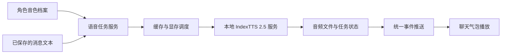

# 邻舍 TTS 接入方案

整理日期：2026-09-29。本文是待实施方案，基于现有项目结构和 IndexTTS 2.5 官方资料整理；新增模块、数据表与接口均为拟议设计，尚未实现。

## 1. 目标与已确定方向

采用「角色音色库 → 本地 TTS 服务 → 聊天气泡播放」的方案，让用户上传一小段声音、试听并绑定角色，随后点击角色消息即可朗读。

- 首选引擎：IndexTTS 2.5。
- 部署方式：与现有生图共用一台电脑；本次检查到的显卡为 RTX 5070 Ti，16GB 显存。
- 推理服务：官方 Python 推理包封装成本地 HTTP 服务，由现有 Node 后端调用。
- 首版入口：角色声音管理、试听、私聊消息手动朗读。
- 后续扩展：自动朗读、批量录入、情绪联动、小镇 NPC 与奇遇对白配音。
- 首版暂不做：每角色模型训练、实时语音通话、语音识别聊天、逐 token 合成。

声音是独立于角色人格与外观的资产。人格描述可以辅助挑选音色，但不能代替参考录音；TTS 不走用于生图的 `characterPersona.js`。

## 2. IndexTTS 2.5 的使用口径

IndexTTS 2.5 支持单段参考音频的零样本音色克隆。基础调用不要求参考音频逐字稿，也不需要给每个角色单独训练模型。[官方模型说明](https://huggingface.co/IndexTeam/IndexTTS-2.5)

主要输入分为：

| 输入 | 作用 | 项目中的来源 |
|---|---|---|
| `spk_audio_prompt` | 音色参考 | 角色绑定的主参考音频 |
| `text`、`lang` | 要朗读的文本与语言 | 清洗后的消息文本、语言设置 |
| `emo_audio_prompt` / `emo_vector` | 情绪参考或情绪向量 | 可选情绪样本、后续情绪映射 |
| `duration_factor` | 控制生成时长与语速 | 用户可理解的语速设置 |

音色与情绪可以分别控制。`duration_factor` 大于 1 表示更慢，项目若采用「语速倍数越大越快」的界面，应由适配层换算。文本情绪推断需要额外启用 QwenEmotion；首版优先自然表达，不加载这项额外能力。[官方使用说明](https://github.com/index-tts/index-tts#-python-api)

当前官方推理代码会将音色参考截取到前 15 秒。因此，录入时必须先选片段，再把选中的片段作为参考输入，不能依赖引擎从长录音里寻找合适部分。[参考音频处理代码](https://github.com/index-tts/index-tts/blob/main/indextts/infer_v2_5.py#L571-L592)

实施时固定代码提交与模型版本；参考长度、参数和运行表现以固定版本验证结果为准。

## 3. 角色声音如何方便录入

### 3.1 标准流程

角色详情 → 声音 → 上传音频 → 裁剪与试听原音 → 生成试听 → 设为角色声音。

1. **打开声音管理**：角色详情增加「声音」入口，显示未设置或当前音色名称，与现有立绘管理保持一致。
2. **上传素材**：首版支持常见音频文件；后台解码并转换为统一格式，不要求用户自行转换 WAV。
3. **选择片段**：展示波形、拖动起止点、循环试听。产品默认建议选取 6～12 秒清晰、单人、自然说话的片段；这是体验建议，不是模型硬性下限。
4. **生成试听**：提供日常问候、疑问句、稍长对白等固定测试文本，并允许自定义输入。测试文本应不同于原录音，便于判断克隆效果。
5. **保存与绑定**：用户比较原音与合成结果后，保存音色并绑定当前角色。普通操作到此结束，高级参数收进折叠区。

默认引导选择无背景音乐、无其他人插话、无明显混响或失真的素材。没有声音素材的角色，可以先从已有音色库选择，也可以在外部制作参考音频后导入。

### 3.2 自动预处理

- 保留原文件，另存裁剪与格式转换后的参考文件。
- 处理首尾静音、声道与格式，检查有效语音时长、音量过低、明显削波等问题。
- 保留句子内部正常停顿，裁剪边界避免截断音节。
- 降噪作为可选处理，保留处理前后对比，避免过度处理改变音色。
- 上传采用独立文件接口，限制体积与解码时长；不沿用图片的整段 base64 JSON 上传方式处理长音频。

### 3.3 音色档案

| 内容 | 是否必填 | 说明 |
|---|---|---|
| 主音色参考 | 必填 | 一段即可建立可用音色，优先自然、稳定的表达 |
| 情绪参考样本 | 可选 | 开心、低落等表达参考，不要求每种情绪都录制 |
| 默认语速与语言 | 有默认值 | 简单可理解的设置 |
| 名称与备注 | 名称自动生成 | 区分不同版本，如「日常」「成年版」 |
| 参考音频转写 | 可选 | 用于检索和检查素材，不是基础克隆必填项 |

角色可以切换绑定的音色；音色库允许复用。换主参考或合成默认参数时记录新版本，保证试听与历史合成记录可追溯。

### 3.4 后续提升录入效率

- 麦克风录音：复用上传后的裁剪与试听流程；实施时检查浏览器安全上下文与麦克风权限要求。
- 视频提取：上传后抽取音轨，再由用户选择参考片段。
- 长素材辅助选段：按静音或语音活动检测推荐候选片段，仍由用户确认说话人及内容。
- 批量导入：多文件拖入，按「角色名_日常.wav」「角色名_开心.wav」提出绑定建议，展示确认表；重名、未知角色和含糊匹配不自动绑定。

## 4. 接入架构

### 4.1 职责划分

- **前端**：录入、裁剪范围选择、试听、播放控制、任务状态展示。
- **Node 后端**：角色与音色绑定、文本准备、缓存、任务队列、持久化、与生图协调、结果推送。
- **Python 服务**：加载模型、解析受控的参考文件、执行推理、输出音频、按调度要求释放模型。
- **文件存储**：音频独立存放在 `data/audio/`，不混入图片资产扫描与压缩流程。

Python 服务仅供本地后端调用，模型在加载后复用。保留健康检查、加载状态、推理与卸载能力；不要每句话都启动进程并重新加载权重。实际卸载方式要验证，必要时回收推理工作进程。

后续迁往独立 GPU 服务时，可以增加 vLLM-Omni 适配。官方已提供音色上传复用与 `/v1/audio/speech` 接口；首版不依赖这套部署。[vLLM 官方方案](https://recipes.vllm.ai/IndexTeam/IndexTTS-2.5)

### 4.2 现有项目接入点

| 现有位置 | 接入方式 |
|---|---|
| `web-ui/src/components/CharacterDetailModal.vue` | 增加角色声音管理入口 |
| `web-ui/src/views/SettingsView.vue` | 服务状态、全局开关与默认偏好 |
| `agent-core/src/routes/chat.js` | 基于已清洗、已保存的消息发起朗读任务 |
| `agent-core/src/services/unifiedStreamBus.js` | 推送语音排队、完成、失败事件 |
| `web-ui/src/stores/unifiedStream.js` | 接收语音任务状态，更新气泡 |
| `agent-core/src/services/comfyClient.js` | 生图任务协调与显存释放的接入点 |
| `web-ui/src/utils/townBgm.js` | 后续小镇配音时降低背景音乐音量 |

拟新增语音服务、音色资产服务、IndexTTS 适配器、语音路由、前端播放管理和声音管理弹窗。具体文件划分在实施时确定，避免把完整 TTS 逻辑塞进聊天路由。

## 5. 数据与消息处理

### 5.1 数据分层

| 数据 | 建议保存内容 |
|---|---|
| 音色档案 | 名称、默认语言与语速、版本、主参考样本 ID |
| 声音素材 | 所属音色、用途、原文件与处理文件路径、裁剪范围、时长、内容哈希 |
| 角色绑定 | 角色 ID、音色 ID、是否启用、角色级覆盖参数 |
| 合成记录 | 来源类型与 ID、实际朗读文本、音色版本、模型版本、参数、状态、输出位置、错误信息 |

数据库保存信息与路径，音频保存为文件。声音录入与生成缓存分别管理；清理生成缓存不能误删主参考。角色、消息和音色删除时，应按引用关系处理资产，不能直接删除仍被复用的文件。

缓存键包含：实际朗读文本、参考文件内容哈希、模型版本、文本处理版本、语言、语速、情绪及其他影响输出的合成参数。内容相同的重复请求复用任务或成品，更换音色后不误用旧缓存。

### 5.2 消息朗读

- 首版仅朗读已保存的角色消息，以消息 ID 关联任务，确保声音属于实际发言角色。
- 项目已有完整原文与分句气泡两层存储；首版以气泡展示文本为输入，不直接朗读 `raw_messages` 原文。
- 清洗表情标记、图片指令、内部标签和非对白内容，保留原消息不变；没有可朗读文本时不创建任务。
- 文本回复不等待 TTS。语音失败只影响播放按钮，不影响聊天、生图与消息保存。
- 任务状态至少包含排队、生成、完成、失败、取消；重复点击不重复推理，失败允许重试，重启后恢复或明确结束遗留任务。
- 结果通过统一事件推送，历史页面也能查询状态与音频，不能只依赖一次性推送。

### 5.3 播放与情绪

- 使用统一播放器，同一时间只播放一条语音；切换角色或播放另一条时停止上一条。
- 自动朗读默认关闭；启用后按消息顺序播放，避免重连或补发事件重复播音。
- 为浏览器自动播放限制提供明确的手动播放入口。
- 首版采用自然表达与默认语速；后续再将角色状态、文本语境映射到 TTS 情绪。
- 现有 VAD 情绪与 IndexTTS 八维情绪定义不同，需独立映射，不能直接传值；也不把整张人格卡当作情绪指令。
- 首版不修改聊天 LLM 输出协议。将来若增加结构化语音字段，必须同步维护完整 JSON 示例、约束及解析逻辑。

## 6. 同机生图与显存调度

16GB 显存能否让生图与 TTS 同时驻留，取决于工作流、推理长度、精度和其他占用。官方模型卡的约 6GB 推理需求只能作为初步参考，不能当作峰值保证。[模型运行说明](https://huggingface.co/IndexTeam/IndexTTS-2.5#getting-started)

首版采用保守策略：单个 TTS 推理任务、按需加载，并协调生图与 TTS 的 GPU 使用。

1. **当前生图完成后再切换**：TTS 请求显示等待状态，不中断正在生成的图片。
2. **排队优先级**：用户试听与手动朗读优先于后台预生成；增加等待上限或公平调度，避免图片任务长期饥饿。
3. **切换前释放显存**：必要时卸载另一侧模型，确认释放后再加载。串行执行任务不等于闲置模型已经释放显存。
4. **连续语音复用模型**：短时间内连续朗读复用已加载的模型，在空闲或生图请求到来时释放，减少频繁切换。
5. **缓存优先**：命中音频缓存直接播放，不申请 GPU。
6. **覆盖所有生图入口**：协调应在统一提交层生效，不能只保护私聊生图；对用户在外部 ComfyUI 中启动的任务也需要检查状态，并处理检查后的竞争情况。
7. **失败可恢复**：显存不足时结束当前失败任务、释放资源并提供重试，不无限自动重试或阻塞聊天。

应分别测量冷启动、模型已加载时的推理、长文本、角色切换和生图切换成本，再决定是否开放同时驻留或更积极的自动朗读。当前不承诺实时速度。

## 7. UI 约束

- 遵循 `docs/design-system.md`，复用 Linshe 按钮、输入框、选择框、开关、页签与弹窗。
- 声音管理融入角色详情的现有设计语言；原音试听与合成试听清楚区分，加载、失败与重试状态可见。
- 页面、内容区切换，以及弹窗开关采用 0.3 秒过渡；关闭动画完成后再隐藏或卸载。
- 检查桌面、移动端、暖色与暗夜主题，以及与 Toast、世界观、信箱等页面的一致性。
- 后续小镇对话配音沿用 `TownDialogueStage.vue` 的互动方式，在原有对白中增加播放能力；不另建步骤式玩法或结算面板。

## 8. 实施阶段与验收

### 阶段一：最小可用闭环

- 本地 IndexTTS 服务与连接状态检查。
- 音频上传、裁剪、原音试听、生成试听、保存与角色绑定。
- 私聊消息点击朗读、基础缓存、状态推送与失败重试。
- 单任务推理与最低限度的生图显存协调，作为同机上线的前置条件。

验收：选择 2～3 个角色，用未在参考录音中出现的台词验证克隆效果；重复播放复用缓存；无音色、无可读文字、服务离线和显存不足时，聊天仍正常；生图与语音切换可恢复。

### 阶段二：日常使用体验

- 自动顺序朗读、停止与取消、历史音频复用。
- 调度优先级、公平性、空闲卸载与缓存清理。
- 麦克风录入、批量导入、长素材辅助选段。

验收：消息播放顺序正确，不重复、不串角色；切换页面不会留下不受控播放；重复点击、事件重连、进程重启均有明确状态。

### 阶段三：角色表现与玩法扩展

- 情绪样本、保守的情绪映射与角色语速偏好。
- 小镇 NPC、奇遇对白及群聊的按发言人配音。
- 配音时降低 BGM 音量，结束后恢复。
- 根据实际延迟评估分段预生成与更细粒度的音频流式播放。

### 实施时的重点验证

- 声音质量：相似度、自然度、名字与多音字读法、不同情绪下音色稳定性。
- 性能：冷启动与热推理耗时、首段等待时间、峰值显存、生图切换耗时。
- 数据正确性：缓存失效、发言人绑定、重复请求、文件引用与清理。
- 界面：移动端裁剪操作、两套主题、开关过渡、播放状态与错误反馈。

对文本处理、缓存键、任务状态和调度等关键逻辑编写正式测试，放入项目现有测试目录。需要模型和 GPU 的质量与性能验证单独记录；临时验证脚本与日志用完清理。
